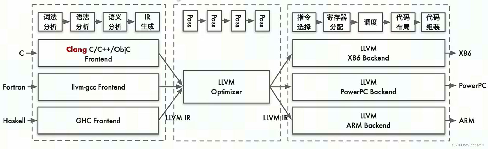
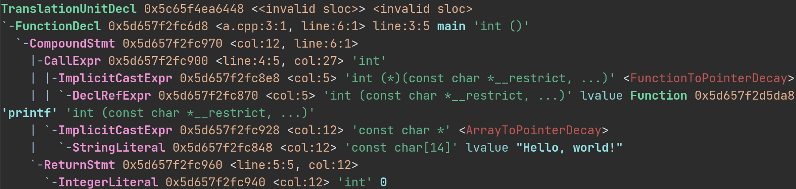
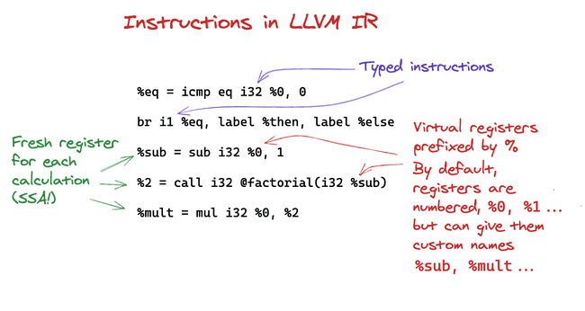
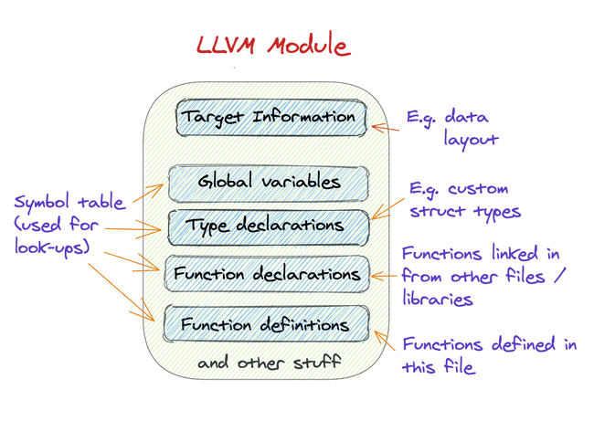
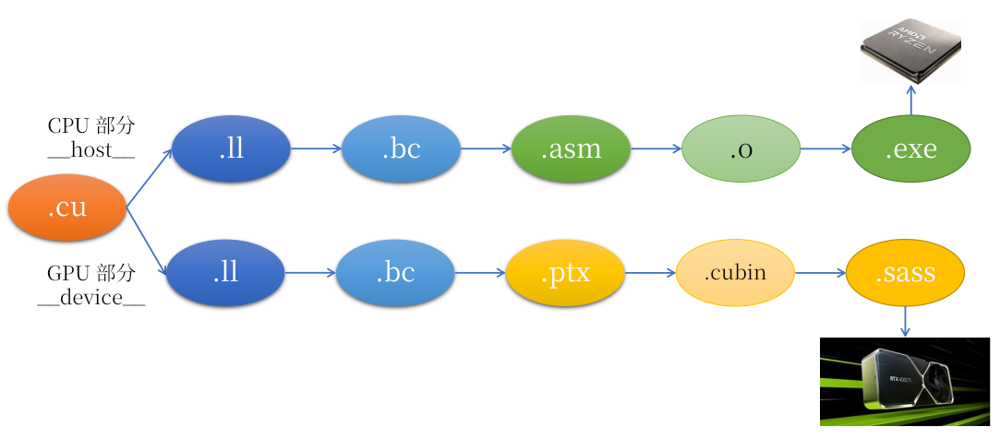

# 小彭老师带你学 LLVM

[TOC]

## LLVM 介绍

LLVM 是一个跨平台的编译器基础设施，它不是一个单一的编译器，而是一系列工具和库的集合，其提供丰富的数据结构 (ADT) 和中间表示层 (IR)，是实现编译器的最佳框架。

LLVM 是编译器的中后端，中端负责优化，后端负责最终汇编代码的生成，他并不在乎调用他的什么高级语言，只负责把抽象的代数运算，控制流，基本块，转化为计算机硬件可以直接执行的机器码。

> {{ icon.tip }} 也有些沙雕教材会把中端和后端统称为后端……



Clang 只是 LLVM 项目中的一个前端，其负责编译 C/C++ 这类语言，还有用于编译 Fotran 的 Flang 前端。除此之外，诸如 Rust、Swift、Haskell 之类的语言，也都在使用 LLVM 做后端。

> {{ icon.story }} 举个例子，析构函数在 `}` 处调用，这是 C++ 的语法规则，在 Clang 前端中处理。当 Clang 完成 C++ 语法规则，语义规则的解析后，就会创建一种叫中间表示码（IR，Intermediate Representation）的东西，塞给 LLVM 后端。在 IR 层面，析构函数和普通 C 语言函数已经没有区别，都是一个函数调用，析构函数调用的时机在 Clang 生成 IR 的时候就已经确定（基于 C++ 语法规则决定）。LLVM 并不关心这个函数是 C++ 析构函数还是 Rust 函数，他只知道这是个函数调用，只需要这个信息，就可以去做优化了。

> {{ icon.detail }} IR 介于高级语言和汇编语言之间，发明 IR 是为了统一来自不同源码语言，去往不同目标硬件的一层抽象层。一是便于前端的统一实现，Clang 这样的前端只需要生成抽象的数学运算，控制流这些 IR 预先定义好的指令就可以了，不用去专门为每个硬件设计一套生成汇编的引擎；二是 LLVM IR 采用了对优化更友好的 SSA 格式（稍后介绍），而不是糟糕的寄存器格式，大大方便了优化，等送到后端的末尾时才会开始将 IR 翻译为汇编代码，最终变成可执行的机器码。

如果没有 IR 会怎样？假设有 $M$ 种语言，$N$ 种硬件，就需要重复实现 $M \times N$ 个编译器！而 IR 作为中间表示层，令语言和硬件的具体细节解耦了，从而只需要写 $M + N$ 份代码就可以：语言的开发者只需要考虑语法如何变成数学运算和控制流，硬件厂商只需要考虑如何把数学和跳转指令变成自己特定的机器码。因此，不论是 LLVM/Clang 还是 GCC 家族，跨平台编译器内部都无一例外采用了 IR 做中间表示。

> {{ icon.story }} 有了统一的抽象 IR 以后，不管你是 C++ 析构函数还是 C 语言普通函数，进了 IR 以后都是一样的函数调用，减轻了编译器中后端开发者的心智负担。要开发一种新语言，只管解析完语法生成 IR 输入 LLVM，他会替你包办好优化和汇编的事。

### 参考资料

- LLVM 官方仓库：https://github.com/llvm/llvm-project
- LLVM 用户文档：https://llvm.org/docs/
- LLVM 源码级文档：https://llvm.org/doxygen/
- LLVM IR 全文档：https://llvm.org/docs/LangRef.html
- 《Learn LLVM 17》：https://github.com/xiaoweiChen/Learn-LLVM-17
- 《开始学习 LLVM》：https://getting-started-with-llvm-core-libraries-zh-cn.readthedocs.io/zh-cn/latest/
- 《miniSysY 编译实验》：https://buaa-se-compiling.github.io/miniSysY-tutorial/pre/llvm.html
- 《A Gentle Introduction to LLVM IR》：https://mcyoung.xyz/2023/08/01/llvm-ir/
- 《LLVM IR C++ API Tutorial》：https://mukulrathi.com/create-your-own-programming-language/llvm-ir-cpp-api-tutorial/

> {{ icon.warn }} 不建议按顺序全部逐个阅读完，这么多文档小彭老师都看不完。建议遇到了不熟悉的指令时，再去针对性地找到相应章节，学习。

## 为什么选择 LLVM

- 如果你对 C++ 语言的底层实现感兴趣，编译器是绕不过的一环。御三家中，MSVC 是闭源的无法学习，GCC 代码高度耦合，且很多原始的 C 语言“古神低语”混杂其中，可读性较差。Clang 是一个跨平台的 C++ 编译器前端，而 LLVM 正是他的后端，高度模块化的设计，代码质量优秀，很容易加入自己的新模块，最适合编译器新人上手学习。除去 Clang 负责的 C++ 语法解析后，LLVM 后端占据了半壁江山。你想不想探究编译器是如何利用未定义行为优化的？想不想知道为什么有时 C++ 编译器出现异常的行为？想不想了解怎样才能写出对编译器友好的代码，方便编译器自动帮你优化？那就来学习 LLVM 吧！
- 前端和后端众多，无论你是打算开发一种新型语言，还是自研一种新的 CPU 架构，考虑支持 LLVM 作为中端几乎是你唯一的选择。
- 对于 CPU/GPU 硬件厂商而言：由于丰富的前端，支持 LLVM 将使你的硬件直接支持 C/C++/CUDA/OpenCL/SyCL/Objective-C/Fortran/Rust/Swift/Haskell 等所有 LLVM 有前端的语言。例如有的国产显卡基于 LLVM 添加了自己的硬件指令集作为后端，然后再利用 LLVM 的 CUDA 前端，就实现了兼容 CUDA，AMD 得以实现 CUDA 兼容也是基于此。反之，新语言也可以使用 LLVM 的 PTX 后端输出，从而支持在 NVIDIA 显卡上执行。
- 对于想发明新语言或为现有脚本语言实现 JIT 加速的开发者而言：由于丰富的后端，新语言使用 LLVM 就能直接支持 x86/ARM/MIPS/PPC/BPF/PTX/AMDGPU/SPIR-V 等各种架构和指令集，而自己不用增加任何底层细节负担。例如一些 Rust 用户虽然宣称可以取代 C++，但 Rust 编译器最终仍是调用 LLVM 实现编译，产生可以执行的二进制码。自己一个个适配所有硬件平台的机器码成本实在太高了，且不论还要专门开发所有的优化 pass，而 LLVM 作为业界支持最完善的现成品在很长一段时间内都很难代替。
- 中端优化和分析能力强大，新语言若基于 LLVM，优化方面的工作都有现成的实现，可以全部让 LLVM 代劳，自己只需要负责解析语法，生成 LLVM IR 即可，如何优化后生成二进制码根本无需操心，LLVM 会自动根据当前的目标平台判断。
- 高度自包含，完全基于 CMake 的模块化构建，充满现代感。用户可自行选择要构建的模块。且几乎完全无依赖就能构建，有 CMake 有编译器就行，无需安装繁琐的第三方库。相比之下 GCC 采用落后的 Makefile + AutoConf 构建系统，且版本要求苛刻。
- LLVM 采用的 MIT 开源协议十分宽松，对商用自由度较高。且代码质量优秀，容易自己插入新功能，可修改后供自己使用，因此常用于闭源驱动中（例如 NVIDIA 的 OpenGL 驱动等）。相比之下 GCC 采用的 GPL 协议就比较严格，不得自己修改后闭源发布（必须连同源代码一起发布）。
- LLVM 附带了许多实用命令行工具，帮助我们分析编译全过程的中间结果，理解优化是如何发生的。例如 llvm-as（LLVM IR 转为压缩的字节码），llvm-dis（字节码转为 IR），opt（可以对 IR 调用单个优化 pass），llc（将字节码转换为目标机器的汇编代码），llvm-link（IR 级别的链接，输入多个字节码文件，产生单个字节码文件），lld（对象级别的链接，类似于 GNU ld），lli（解释执行字节码），llvm-lit（单元测试工具）。
- 一些芯片相关的大厂中，编译器方面的岗位需求量很大。而其中主要用的，例如 NVIDIA 的编译器 nvcc，其后端就是基于 LLVM 魔改的，因此学习 LLVM 很有就业前景。

> {{ icon.detail }} 为什么有了 Clang 还要 nvcc？虽然 Clang 也能支持 CUDA，但 Clang 只能把 CUDA 编译成所有 NVIDIA 显卡都能通用的 PTX，无法生成专门对不同显卡型号特化 SASS 汇编（需要调用 NVIDIA CUDA Toolkit 提供的 ptxas 才能转换）。而 nvcc 的前端除了是自己的，后端同样是调用 LLVM 生成 PTX 汇编，只是 NVIDIA 对 LLVM 做了一些闭源的魔改（其实早期 nvcc 的后端是基于 NVIDIA 自研的 NVVM 后端，但是发现效果不好，最近正在逐步切换到 LLVM 后端，毕竟是老牌项目）。如果对 C++ 新特性有追求，可以用 Clang 前端 + LLVM 生成 PTX + ptxas 汇编的组合，实现自由世界的 CUDA 工作流（之后介绍）。但是因为 ptxas，以及 CUDA 其他运行时库的需要，Clang CUDA 依然需要安装 CUDA Toolkit 才能正常运行，且对 CUDA 版本要求比较严格，可能需要较多的配置功夫。

> {{ icon.fun }} Rust 编译器最近也有提出了 gcc-rust，使用 GCC 做后端代替 LLVM 的计划……就不能自研一个 RRVM 么？不仅是 Rust 编译器，你会发现很多 Rust 项目最终或多或少都在依赖一些 C++ 库，比如 RustDesk 这款高性能的远程控制软件，不知咋地就非要依赖 libyuv 和 libvpx，还要求用沙雕的 vcpkg 安装……是自己写不来还是懒得写了？Rust 不是高性能的系统级语言么？如果 Rust 社区不会写 YUV 编码，可以雇佣小彭老师帮忙的。总之，现在搞得 Rust 和 Python 一样，成包皮语言了。今后对 Rust 的学习，恐怕还是屈服于实用，和 Python 一样各种“API bindings”。

### LLVM 上下游全家桶的宏伟图景

LLVM 项目不仅包含了 LLVM 本体，还有一系列围绕 LLVM 开发的上下游工具。例如 Clang 编译器就是 LLVM 项目中的一个子项目，他是一个 C/C++/CUDA/OpenCL/SyCL/Objective-C 等 C 类语言的前端，只负责完成语法的解析，实际编译和二进制生成交给 LLVM 本体（中后端）来处理。通常说的 LLVM 指的是 LLVM 本体，其是一个通用的编译器基建，仅包含中端（各种优化）和后端（生成 x86/ARM/MIPS 等硬件的指令码）。Clang 解析 .cpp 文件后产生 IR，调用 LLVM 编译生成的 .o 对象文件，又会被输入到同属 LLVM 项目的一个子项目：LLD 链接器中，链接得到最终的单个可执行文件（.exe）或动态链接库（.dll），LLD 还可以开启链接时优化，这又会用到 BOLT 这个链接时优化器，对生成的单个二进制做进一步汇编级别的优化。不仅如此，著名的 C++ 标准库实现之一，libc++，也是 LLVM 项目的一部分，相比 GCC 家族的 libstdc++ 更简单，更适合学习。不仅如此，还有并行的 STL 实现 pstl，OpenCL 编译器 libclc 等……应有尽有，是编译器开发者的天堂。

Clang 编译 C++ 程序的整个过程：

**Clang 前端解析 C++ 语法 -> LLVM 中端优化 -> LLVM 后端生成指令码 -> LLD 链接 -> BOLT 链接后优化**

而 GCC 就没有这么模块化了，虽然 GCC 内部同样是有前端和中端 IR，但是整个就是糊在一个 GCC 可执行文件里，难以重构，积重难反，也难以跨平台（MinGW 还是民间自己移植过去的，并非 GCC 官方项目）。和 Clang 能轻易作为 libclang 和 libLLVM 库发布相比，高下立判。MSVC 更是不必多说，连源码都不开放，让人怎么学习和魔改啊？

### 学习 LLVM 前的准备

要学习 LLVM，肯定不能纸上谈兵。LLVM 是开源软件，最好是自己下载一个 LLVM 全家桶源码，然后自己从源码构建。

注意：我们最好是从源码构建 LLVM 和 Clang，方便我们动手修改其源码，添加模块，查看效果。下载二进制发布版 LLVM 或 Clang 的话，虽然同样可以使用所有的命令行工具，就只能对着 IR 一通分析盲猜了。

> {{ icon.fun }} 源码面前，了无秘密。

虽然 LLVM 几乎是无依赖的，只需要 CMake 和编译器就能构建，但依然推荐使用 Linux 系统进行实验，以获得和小彭老师同样的开发体验。Windows 用户建议使用 Visual Studio 或 CLion 等强大 IDE 帮助阅读理解源码；Linux 用户建议安装 [小彭老师 vimrc](https://github.com/archibate/vimrc)；或者如果你是远程 Linux，可以试试看 VSCode 的远程 SSH 连接插件；CLion 似乎也有远程插件，只不过需要在远程安装好客户端。

强大的 IDE 和编辑器对学习任何大型项目都是必不可少的，特别是跳转到定义，以及返回这两个操作，是使用频率最高的，在源码之间的快速跳转将大大有助于快速理解和掌握代码结构。

> {{ icon.tip }} 如果实在没有条件自己构建 LLVM 源码，或者 IDE 比较拉胯：可以去 LLVM 的在线源码级文档（使用 Doxygen 生成）看看。其不仅提供了 LLVM 中所有类和函数的详尽文档，参数类型，用法说明等；还提供了每个函数的所在文件和行号信息，点击类型或函数名的超链接，就可以在源码和文档之间来回跳转。还能看到哪里引用了这个函数，还能显示类的继承关系图，非常适合上班路上没法打开电脑时偷学 LLVM 源码用。例如，`llvm::VectorType` 这个类的文档：https://llvm.org/doxygen/classllvm_1_1VectorType.html

### 一点忠告

对于 LLVM 这种大型项目，由于你是初学者，务必做到“不求甚解”！

你必然一时半会不能完全看懂每个细节，千万不要死扣细节，一个细节不理解就硬瞪眼干看！

看不懂的先跳过去即可，当他不存在。电视连续剧跳一两集，甚至从中间开始看，都能看懂呢！没有那么严格的顺序依赖。

以后知识储备够了，或者工作中需要用到了，再回过头来查漏补缺也不迟。

我最怕某些同学盯着某个次要的细节死劲想，想不出就止步不前了。比如他遇到一个老外说：

My dick is bleeding, could you tell me where is the toilet?

而 ‘dick’ 是这个同学看不懂的“生词”，他就死扣这个字眼，认为看不懂这个词，后面的对话也会看不懂。

实际上，只需要把这个看不懂的地方跳过，当他不存在，就当他是一个乱码塞在那里干扰你阅读的，你只管继续看下去：

My ��� is �����, could you tell me where is the toilet?

一样能看懂老外想要问的是厕所（toilet），根本不需要知道前面的 ‘dick’ 是什么意思。

> {{ icon.fun }} 致涂黑世界的书信

## LLVM 开发环境搭建

### 环境准备

LLVM（和 Clang）的构建依赖项几乎没有，只需要安装了编译器和 CMake 就行，非常的现代。

#### Linux/MacOS 用户

首先安装 Git、CMake、Ninja、GCC（或 Clang）。

> {{ icon.tip }} 其中 Ninja 可以不安装，只是因为 Ninja 构建速度比 Make 快，特别是当文件非常多，而你改动非常少时。而且 Ninja 默认就开启多核并行构建，所以大型项目通常会尽量给 `cmake` 指定一下 `-G Ninja` 选项，让其使用更高效的 Ninja 后端构建。

Arch Linux:

```bash
sudo pacman -S git cmake ninja gcc
```

Ubuntu:

```bash
sudo apt-get install git cmake ninja-build g++
```

MacOS:

```bash
brew install git cmake ninja gcc
```

开始克隆项目（需要时间）：

```bash
git clone https://github.com/llvm/llvm-project
```

如果你的 GitHub 网速较慢，可以改用 Gitee 国内镜像（只不过这样你就没法给 LLVM 官方水 PR 了 🤣）：

```bash
git clone https://gitee.com/mirrors/LLVM
```

#### Windows 用户

即使是 LLVM 这样毫无依赖项的项目，“只需要安装了编译器和 CMake 就行”，在 Windows 用户看来依然非常科幻。

好在微软也意识到了自己的残废，现在 Virtual Studio 2022 已经替你包办好了（自带 Git、CMake 和 Ninja 了）。

如果你是用 VS2022 自带的 Git 克隆 llvm-project，记得 cd 到 llvm 文件夹里再用 cmake，然而贵物 IDE 的一个 cd 都是如此的困难。

所以这边建议你直接先把 llvm-project 仓库作为 ZIP 下载下来，然后打开其中的 `llvm` 子文件夹，然后用 VS2022 打开其中的 CMakeLists.txt，然后开始构建。

然后，要开启一个 CMake 选项 `-DLLVM_ENABLE_PROJECTS="clang;clang-tools-extra"`，才能构建 Clang 子项目（否则构建的是赤膊 LLVM，没有任何前端，这毫无意义）。仅此是指定这一个小小选项对于 IDE 受害者又是何等的困难……他们需要在 VS2022 中打开 CMakeSettings.json，修改 x64-Debug 的配置，点击添加一个变量 LLVM_ENABLE_PROJECTS，值为 "clang;clang-tools-extra"……如果他们要改成 Release 配置，又要点击加号创建 x64-Release（千万别点错成 x86-Release！），然后再次点击添加一个变量 LLVM_ENABLE_PROJECTS……

因为 llvm-project 是许多项目的集合，根目录里并没有 CMakeLists.txt，而 VS2022 似乎只能识别根目录的 CMakeLists.txt……

> {{ icon.fun }} 正常系统只需要给你写一串命令，你只管复制粘贴到 Shell 里一执行就搞定了。脑瘫系统需要大量无谓的文字描述和截图箭头指示半天，还经常有人看不懂，要反复强调，画箭头，加粗字体，才能操控他的鼠标点击到正确按钮上。我也想把鼠标宏录下来，可是不同电脑分辨率不同，窗口位置又很随机，电脑响应速度又随机，有时候 C 盘，有时候又 D 盘，根本不给一个统一的操作方式,统一的命令行就没有这种烦恼。所以，能卸载的卸载，能双系统的双系统，能 WSL 也总比腱鞘粉碎器（鼠标）好，至少能一键粘贴小彭老师同款操作。

### 项目目录结构

```
$ cd llvm-project
$ ls
bolt                CONTRIBUTING.md      LICENSE.TXT  pstl
build               cross-project-tests  lld          pyproject.toml
build.sh            flang                lldb         README.md
clang               libc                 llvm         runtimes
clang-tools-extra   libclc               llvm-libgcc  SECURITY.md
cmake               libcxx               mlir         third-party
CODE_OF_CONDUCT.md  libcxxabi            openmp       utils
compiler-rt         libunwind            polly
```

- 注意到这里面有很多的子项目，其中我们主要学习的就是这里面的 llvm 文件夹，他是 LLVM 的本体。其中不仅包含 LLVM 库，也包含一些处理 LLVM IR 和字节码的实用工具（例如 llvm-as）。
- 其次就是 clang 文件夹，这个子项目就是大名鼎鼎的 Clang 编译器，他也是基于 LLVM 本体实现的，本身只是个前端，并不做优化和后端汇编生成。
- clang-tools-extra 这个子项目是 clangd、clang-tidy、clang-format 等 C/C++ 代码质量工具，可以选择不构建。
- libc 是 Clang 官配的 C 标准库，而 libcxx 是 Clang 官配的 C++ 标准库，想学标准库源码的同学可以看看。
- flang 是 LLVM 的 Fortran 前端，编程界的活化石，没什么好说的。
- lldb 是 LLVM 官方的调试器，对标 GCC 的 gdb 调试器，VSCode 中的调试默认就是基于 lldb 的。
- lld 是 LLVM 官方的二进制链接器，对标 GCC 的 ld 和 ld.gold；而 bolt 是链接后优化器，用的不多。
- compiler-rt 是诸如 AddressSantizer（内存溢出检测工具）、MSAN（内存泄漏检测）、TSAN（线程安全检测）、UBSAN（未定义行为检测）等工具的实现。
- mlir 是 LLVM 对 MLIR 的编译器实现（一种为机器学习定制，允许用户自定义新的 IR 节点，例如矩阵乘法等高阶操作，方便特定硬件识别到并优化成自研硬件专门的矩阵乘法指令，最近似乎在 AI 孝子中很流行）。
- libclc 是 LLVM 对 OpenCL 的实现（OpenCL 语言规范的编译器），OpenCL 是孤儿，没什么好说的。
- openmp 是 LLVM 对 OpenMP 的实现（一种用于傻瓜式 CPU 单机并行的框架，用法形如 `#pragma omp parallel for`）。
- pstl 是 LLVM 对 C++17 Parallel STL 的实现（同样是单机 CPU 并行，优势在于利用了 C++ 语法糖，也比较孤儿，用的不多）。
- cmake 文件夹并不是子项目，而是装着和 LLVM 相关的一些 CMake 脚本文件。
- build 文件夹是使用过 CMake 后会才生成的一个文件夹，是 `cmake -B build` 命令生成的。其中存储着构建项目过程中产生的临时对象文件和最终的二进制可执行文件，所有的可执行文件都放在 build/bin 子文件夹中，例如 build/bin/llvm-as。如果 CMake 出现不听使唤的问题，可以删除 build 文件夹试试，这会迫使 CMake 重新生成（建议每次修改过 CMake 选项后都删 build）。

### 开始构建

```bash
cd llvm-project
bash build.sh
```

`build.sh` 脚本的内容等价于：

```bash
cmake -Sllvm -Bbuild -DCMAKE_BUILD_TYPE=Release -DLLVM_ENABLE_PROJECTS="clang;clang-tools-extra" -GNinja
ninja -Cbuild
```

> {{ icon.tip }} 你在命令行手动输入这两条命令也是等价的，`build.sh` 只是为了方便。

此处 `-S llvm` 选项表示指定源码路径为根目录下的 `llvm` 子项目文件夹，和 `cd llvm && cmake -B build` 等价，但是不用切换目录。

`-G Ninja` 表示使用 Ninja 后端，如果你没有 Ninja，可以去掉该选项，CMake 将会采用默认的 Makefile 后端（更慢）。

> {{ icon.fun }} 如果你是 Wendous 受害者，请自行用鼠标点击序列在 VS2022 中模拟以上代码之同等效果，祝您腱鞘愉快！

`-DLLVM_ENABLE_PROJECTS="clang;clang-tools-extra"` 表示启用 `clang` 和 `clang-tools-extra` 两个子项目。

这是因为通常用的前端都是 C++，所以 LLVM 官方在 `build.sh` 里就这么写了。

> {{ icon.fun }} 如果你口味比较重，想研究 Fortran 前端，也可以定义该 CMake 变量为 `-DLLVM_ENABLE_PROJECTS="flang"`。

`build.sh` 后，需要花费大约 10 分钟时间（取决于你的电脑配置），这段时间你可以先看下面的基本概念速览。等风扇停了以后，LLVM 和 Clang 就构建好了。

### 运行试试

```bash
ls build/bin
```

## 基本概念速览

> {{ icon.warn }} 只是让你获得一个全局观念（overview），不用深究细节，之后会再详细展开介绍的。

学过 C 语言的同学都知道，一个 C/C++ 源码文件到计算机实际可执行的 EXE 文件之间，主要有两步操作：编译（compile）和链接（link）。


之所以把编译和链接分开，是因为一个项目常常由许多源码文件组成，而不只是单个文件。编译器把 C++ 源码编译成中间对象文件（.o 或 .obj 格式），如果有很多 .cpp 文件，就会得到很多 .o 文件，然后由链接器负责统一链接所有 .o 文件，就得到了最终的 .exe 或 .dll 目标文件。

分离多 .cpp 文件的好处是，编译速度更快，可以并行编译。而且修改了其中一个 .cpp 文件，只需要重新编译那个 .cpp 对应的 .o 文件，然后重新链接最终的 .exe 即可，无需再重复编译其他 .cpp 文件的 .o 文件了。自动检测哪些 .cpp 文件更新了，需要重新编译 .o 文件，是 Makefile 和 Ninja 之类构建系统的职责。

我们现在要来学习的就是其中的编译阶段，这也是大部分人想关注的重点。

在这编译阶段内部，发生了很多有趣的事，但却被传统教材的 C++ “两段式”编译模型（编译 -> 链接）一笔带过了。

就拿这里面的“编译”阶段展开讲讲，编译器是如何将 .cpp 文件转换为充斥着机器指令码 .o 文件的？

> {{ icon.detail }} .o 文件里几乎全是完成的机器指令码，除了部分 call 到外部函数的一部分指令，会留白。这部分留白会等到链接阶段时，由链接器在其他 .o 文件中找到相同的符号时替换上正确的地址和偏移量，得到完整的可执行 .exe 文件。

过去，我们把编译器看作黑箱，进去源码，出来机器码，中间有哪些过程？只能认为是魔法。

现在，有了 LLVM 和 Clang 源码在手，终于可以一探究竟了。

实际上，“编译”这一过程，还可以进一步拆分成三个阶段。

## 编译器的前、中、后端

编译器（Compiler）的工作流程可以分为三个阶段：

1. 前端（Front-end）：负责接收源代码，解析出抽象语法树（AST），并进行语法和语义分析，生成中间表示码（IR）。
2. 中端（Middle-end）：负责优化中间表示码。
3. 后端（Back-end）：负责将优化完毕的中间表示码翻译成机器码。


> {{ icon.fun }} 编译器的前中后端和互联网开发者所说的前后端无关，撞名了而已。
>
> 小彭老师：我是前端高手！互联网大厂：雇佣你。小彭老师：我讨厌 JS！互联网大厂：你不是前端高手吗？小彭老师：编译器前端。

- 如果你想要研究 C++ 语法规则，比如做个 C++ 语法高亮插件，那就需要看前端。libclang 和 clangd 可以帮助你解析 C++ 繁琐的语法，并以 AST 树的结构提供给你。不仅如此，如果你要设计一门新语言，甚至是 OpenGL 驱动（其需要实现 GLSL 编译器），实际上也就是为 LLVM 添加一个前端。
- 如果你对内存模型，性能优化感兴趣，那就去研究中端。这是目前学术研究比较活跃的领域，特别是多面体优化方向，可以尝试水两张 paper 或 PR。这部分都是基于 LLVM IR 操作的，有特别多的算法和数据结构。
- 如果你对汇编语言，机器指令，硬件架构感兴趣，那就去看后端。这里面有把中间表示码翻译成真正可执行的汇编指令的完整过程，自研芯片的大厂通常想要为 LLVM 添加后端。

> {{ icon.detail }} 注意链接阶段（Link）属于链接器的职责，不属于狭义上的编译器；前中后端只是对编译（Compile）这一阶段的进一步拆分。

接下来，让我们走进 LLVM 这座开源工厂，一步步观察一段 C++ 代码被编译成汇编的全过程。

## 语法树（AST）

编译器的前端负责解析 C++ 这类高级语言的源代码，生成抽象语法树（Abstract Syntax Tree，AST）。AST 是源代码的一种抽象表示，其中每个节点代表源代码中的一个语法结构，例如 if、while、for、函数调用、运算符、变量声明等。每个 AST 节点都有自己的属性，例如类型、作用域、修饰符等。

不同类型的 AST 节点有不同的类型名，例如 IntegerLiterial 就表示这是一个整数类型的常量，而 BinaryOperator 就表示这是一个二元运算符（可能是加减乘除等二元运算）。

AST 节点可以有一个或多个子节点，许多节点就构成了一颗语法树。每个 .cpp 文件都可以解析得到一颗语法树，在 C++ 的语法中，每颗树的根部总是一个 TranslationUnitDecl 类型的节点。这是整个翻译单元（TU）的声明，其中包含了任意多的变量、函数、类型的声明等，作为 TU 的子节点存在其中。

对树做了一些语法语义上的正确性检测后，就会遍历这颗树，为每个节点逐一生成对应的 LLVM IR，输入到中后端优化并生成真正的汇编。

```cpp
// Clang 源码中的 AST 节点类型大致长这样（已简化）
struct ASTNode {
    std::string type;
    std::vector<ASTNode *> children;
};
```

> {{ icon.tip }} 这部分的实现在 clang 子项目中。

clang 解析源码生成语法树的案例：

```cpp
#include <cstdio>

int main() {
    printf("Hello, world!");
    return 0;
}
```

运行命令：

```bash
clang -fsyntax-only -Xclang -ast-dump test.cpp
```

- `-fsyntax-only` 意味着只解析语法，不进行编译和链接（不会生成 a.out）；
- `-Xclang` 是指向 Clang 核心传递一个选项，也就是后面紧挨着的 `-ast-dump`；
- `-ast-dump` 是 Clang 核心的选项，表示要求打印出语法树。

输出：

> {{ icon.tip }} 已省略 `<cstdio>` 头文件部分的子节点，仅展示了 main 的部分，否则就太长了。

+ 最根部的 TranslationUnitDecl 节点，是整个当前翻译单元（TU）的声明。

    - 所有的 C++ 源码解析后得到的，总是以 TranslationUnitDecl 为根节点的一颗语法树。
    - **翻译单元**指的就是单个 .cpp 文件，及其导入的所有 .h 头文件拼接形成的整段 C++ 源码，是 C++ 编译的最小单元。不同翻译单元编译成各自的对象文件（.o）后，之间再通过“链接器”连在一起，形成一个最终的目标文件（.exe 或 .dll）。
    - 翻译单元中包含了所有当前 .cpp 及其导入的头文件中变量、函数、类型的声明和定义。

在我们的案例中，整个翻译单元节点有着许多子节点，一大堆都是 `<cstdio>` 头文件中导入进来的函数声明和类型定义。

> {{ icon.tip }} 为了看起来方便，我特意从截图中扣掉了所有来自 `<cstdio>` 的节点，并不是说翻译单元不包括头文件哦！

我们最关心的是其中一个子节点：主函数的函数声明节点，类型为 FunctionDecl。

+ 此处 FunctionDecl 就表明，该节点是一个函数（Function）的声明（Decleration）。注意到后面跟着许多和该函数定义有关的关键信息，让我们逐一分析：
    - 这里的十六进制数 `0x567bdbf246d8` 是 AST 节点在编译器内存中的地址，每次都不一样，无意义。
    - 后面的尖括号 `<a.cpp:3:1>` 里还好心提醒了函数定义的位置。
    - 最后是函数名 `main` 和函数类型 `int ()`，说明这是主函数的函数声明。

有趣的是，该节点的类型是 FunctionDecl，翻译成中文就是函数声明。但是我们写的明明是一个函数的**定义**啊！为什么被 Clang AST 当作了**声明**呢？原来，C++ 官方的话语中，定义也是声明！但声明不都是定义。所以这里的 FunctionDecl 实际上是一个通用的节点，既可以是声明（后面直接接 `;` 的），也可以是定义（后面接着 `{}` 的），要根据是否有子节点（花括号语句块）来判断。

> {{ icon.detail }} 总之，定义和声明是子集关系。当我们要强调一个声明只是声明，没有定义时，会用**非定义声明**这样严谨的律师说法。但日常提问时你说“声明”我也明白，你指的应该是非定义声明。更多相关概念请看[重新认识声明与定义](symbols.md)章节和[白律师的锐评](https://github.com/parallel101/cppguidebook/pull/23)，用文氏图来画就是：{width=150px}

+ 函数定义节点又具有一个子节点，类型是 CompoundStmt。这个实际上就是我们所说的花括号语句块 `{}` 了。他本身也是一条语句，但里面由很多条子语句组成。规定函数声明 FunctionDecl 如果是定义，则其唯一子节点必须是语句块类型 CompoundStmt，也就是我们熟悉的函数声明后紧接着花括号，就能定义函数。如果是非定义声明（仅声明，不定义）那就没有这个子节点。

接下来可以看到 CompountStmt 内部，又有两个子节点：CallExpr 和 ReturnStmt，分别是我们对 printf 函数的调用，和 `return 0` 这两条子语句。

+ ReturnStmt 很好理解，他只有一个子节点，类型是 IntegerLiterial，表示一个整形常数，整数的类型是 int，值是 0。这种有一个子节点的 ReturnStmt 节点，就表示一个有返回值的 return 语句，整体来看也就是我们代码里写的 `return 0`。

> {{ icon.story }} 举一反三，可以想象：如果代码里写的是 `return x + 1`，那么 ReturnStmt 的子节点就会变成运算符为 `+` 的 BinaryOperator。其又具有两个子节点：左侧是 DeclRefExpr 节点，标识符为 `x`；右侧是 IntegerLiterial 节点，值为 1。

然后我们来看 printf 函数调用这条语句：


+ 可以看到是一个 CallExpr，表示这是函数调用，而一个函数调用需要知道两个信息：

    1. 调用哪个函数？在我们的例子里，是 `printf` 函数。
    2. 传递给函数的实参？在我们的例子里，是 `"Hello, world!"` 这个字符串常量。

    这就分别用两个子节点表示了。

    注意到这里 printf 发生了一个隐式转换 ImplicitCastExpr 后才作为 CallExpr 的第一个子节点（回答了调用哪个函数的问题），并且后面注释了说 `FunctionToPointerDecay`。也就是说，`printf` 这个标识符（DeclRefExpr）本来是一个对函数标识符的引用，还没有变成函数指针，这时候还没有完成函数的重载决议。是等到函数被 `()` 调用时，才会触发重载决议，而实现区分重载的方式，实际上就是函数引用自动隐式转换成函数指针的过程所触发的，也就是这里的 ImplicitCastExpr 隐式转换节点了。这种自动发生的隐式转换被称为“退化”（decay）。所以，函数引用无法直接调用，Clang 里一直都是需要退化成指针才调用的。

    然后，这里的函数参数是一个字符串常量，按理说一个 StringLiterial 节点就可以了，为什么还有个 ImplicitCastExpr？这里有个常见误区需要纠正：很多同学常常想当然以为字符串常量的类型是 `const char *`。实际上，字符串常量的类型是 `const char []`，是一个数组类型！数组不是指针，他们是两个完全不同的类型。之所以你会有数组是指针的错觉，是因为数组可以隐式转换为元素类型的指针。而这是“退化”规则之一，这个过程在函数参数、auto 推导的时候是自动发生的（正如上面说的函数引用会在调用时自动“退化”成函数指针一样）。

    数组能自动退化成指针，不代表数组就是指针。例如 int 可以隐式转换为 double，难道就可以说“int 就是 double”吗？同样地，不能说“数组就是指针”。字符串常量的类型，从来都是 `const char [N]`，其中 `N` 是字符串中字符的个数（包括末尾自动加上的 `'\0'` 结束符）。只不过是在传入函数参数（此处是 printf 函数的字符串参数）时，自动隐式转换为 `const char *` 了而已。正如这个 ImplicitCastExpr 后面尖括号的提示中所说，ArrayToPointerDecay，是数组类型到指针类型的自动退化，从 `const char [14]` 自动隐式转换到了 `const char *`。

```cpp
#include <cstdio>

int main() {
    printf("Hello, world!");
    // 等价于
    static_cast<int (*)(const char *, ...)>(printf) ( static_cast<const char *>("Hello, world!") );
    return 0;
}
```

总之，通过观察 Clang AST 树，可以获得很多隐藏的信息，特别是 C++ 的各种隐藏语法规则，可以帮你解构语法糖。

Clang 解析出 AST 树后，会再次遍历该树，生成中间表示码（IR），输入 LLVM 后端编译，产生目标平台的汇编（`-S`）或二进制指令码（`-c`）。

如果指定了 `-emit-llvm` 选项，则不会输入 LLVM 后端产生目标平台的指令码，而是直接把产生的 IR 以 IR 汇编（`-S -emit-llvm`）或 IR 字节码（`-c -emit-llvm`）的格式导出，方便我们分析和查看。

## 中间表示码（IR）

中间表示码是一种抽象的机器指令，它不针对具体的硬件，而是一种通用的指令集。它是一种中间表达，可以被进一步编译为目标代码。

LLVM IR（Intermediate Representation）是一种中间语言表示，作为编译器前端和后端的分水岭。LLVM 编译器的前端——Clang 负责产生 IR，而其 LLVM 后端负责消费 IR。

```txt
C++ 源码 -> IR -> 目标平台汇编
```

IR 介于高级语言和汇编语言之间，发明 IR 是为了统一来自不同源码语言，去往不同目标硬件的一层抽象层。一是便于前端的统一实现，Clang 这样的前端只需要生成抽象的数学运算，控制流这些 IR 预先定义好的指令就可以了，不用去专门为每个硬件设计一套生成汇编的引擎；二是 LLVM IR 采用了对优化更友好的 SSA 格式（稍后介绍），而不是糟糕的寄存器格式，大大方便了优化，等送到后端的末尾时才会开始将 IR 翻译为汇编代码，最终变成可执行的机器码。



> {{ icon.story }} IR 并不是 LLVM 的专利，所有跨平台编译器都使用 IR，包括 GCC 和 MSVC。也有很多独立于编译器的跨平台 IR 规范，例如 SPIR-V、MLIR、MIR，LLVM IR 只是众多 IR 中的一种，专用于 LLVM 编译器全家桶。由于本课程是 LLVM 课程，以后提到 IR，读者应默认指的是 LLVM IR。

LLVM IR 有多种表现形式：

- 内存中的 IR 节点对象，位于 `clang` 和 `libLLVM.so` 进程的内存中，都是一个个 C++ 类，通过指针互相连接。LLVM 作为一个 C++ 程序，处理 IR 时都是要读到内存中处理的。但由于内存中的 IR 对象存在虚表指针以及复杂的树状数据结构，无法直接存入磁盘，也无法供人类阅读，需要序列化为以下两种格式后存储。
- 磁盘中的 IR 汇编（Assembly），以人类可读的文本形式（纯 ASCII 字符）存储在磁盘中，方便人类观察、修改和调试。我们后面的课程，也会经常观察中间产物的 IR 汇编，分析 LLVM 的行为。
- 磁盘中的 IR 字节码（Bitcode），以二进制格式存储的 IR，本质上和 IR 汇编相同，只是以更高效的二进制字节存储。缺点是人类看不懂，优点是节约磁盘空间，方便程序快速解析。

当需要长期储存 IR 的中间结果时会用到 IR 字节码，当需要人类观察分析中间结果时就需要 IR 汇编。

### IR 汇编不是 x86 汇编

注意 IR 汇编并不是真正目标平台的汇编语言（Assembly），他只是一种中间产物。


IR 汇编不是 x86 汇编，正如 IR 字节码不是 x86 的机器码一样。IR 的东西都是 LLVM 开发者自拟的一套格式，和硬件无关，和操作系统也无关。不论目标平台是什么，来自什么源码语言，LLVM IR 汇编和 IR 字节码的格式都是一样的。

> {{ icon.story }} 但不同平台的 IR 会附加不同的 intrinsics 指令，除此之外的部分都是共通的。由于很多程序会利用目标硬件做判断（例如 `#ifdef __x86_64__`），生成不同的 intrinsics，因此 IR 并不是完全跨平台的。

IR 的目的是把大部分通用的计算，例如加减乘除、条件跳转指令，统一成相同的 IR 汇编。而不是 x86 汇编里叫 `call`，ARM 汇编里叫 `bl` 的丑态，这就够了。对于利用硬件特有的指令（例如 SSE、NEON 指令集）来优化，以及内联汇编（`asm` 关键字）等，LLVM IR 也是支持的。

- 通用的那部分 IR 节点，被称为“common IR”，例如 Function、Instruction 等。这部分是跨平台的，统一了分崩离析的各大硬件汇编，便于统一编写优化引擎。
- 和硬件绑定的部分 IR 节点，被称为“specific IR”，例如 MachineFunction、MachineInstr 等。这部分基本是用于模仿目标平台的汇编，就是这部分的存在导致了 LLVM IR 无法跨平台。

在进入后端的“指令选择”阶段后，IR 节点中通用的那部分节点，会逐步被替换为和硬件绑定的相应 MachineInstr 节点，在“指令选择”后的阶段看来，就好像前面输出了一大堆内联汇编一样，最终，逐渐变成了完全的目标平台汇编，最终输出。

### LLVM IR 的特点

IR 和目标平台的汇编相比，不仅仅是统一，好处有很多。

#### 以函数为单位

每个 C++ 文件编译得到的 IR 汇编均由一系列函数定义（和少量特殊指令，比如 `target triple`）组成，所有的 IR 指令都包在函数中。

函数是 LLVM 优化的基本单位，绝大多数 LLVM pass，都是以单个函数为单位来优化的。只有内联优化和 IPO 优化，可以实现跨函数的优化。

> {{ icon.story }} 这也是为什么内联优化不仅仅是“函数原封不动插入调用位置”。把函数插入调用者体内后，两个函数融合为一个函数了，使优化器的“视野”更大（因为大部分优化不能跨越函数边界）！从而帮助了其他以函数为边界的优化 pass 能够更好的优化。例如在 `main` 中以迭代器遍历一个容器：本来 `main` 函数是调用迭代器的 `operator++`，而 `operator++` 不内联掉的话，`main` 的优化器永远无法意识到 `operator++` 实际上就是一个指针的加法，只能老老实实分配 alloca 然后获取出 this 指针传入 `operator++` 函数。而内联以后，`operator++` 的内容暴露在优化 pass 眼前，他就知道可以把迭代器优化成一个静态寄存器了，根本不用为其分配内存！最终产生的汇编一下子从必须分配在栈内存上，到可以把迭代器指针放在寄存器里了。而 IPO (Inter-procedure Optimization) 则是根据函数参数为常数的情况做分发，分发后可以针对不同常数参数的结果做特定优化，但不合并函数，无法赋能其他优化 pass，效果看起来就没有内联强了。但是要注意很多优化 pass 的开销是和函数的大小（IR 指令数量）成正比的，所以内联太多层导致一个函数很大的话，编译会变得比较慢。

#### 任意多个寄存器

寄存器无限量供应！一个函数体内可以定义任意多个寄存器，无需考虑硬件具体提供了多少个寄存器。因为和硬件寄存器脱钩，所以我们可以称之为虚拟寄存器，只在 LLVM 中端里出现，为了便于优化和处理采取的简化策略。

虚拟寄存器统一以 `%0` `%1` `%2` 命名。如果打算手写 IR，也可以自定义名字如 `%x` `%i`，不过 Clang 自动生成的 IR 中寄存器都是从 0 开始，自动递增的命名。

在后端的“寄存器分配”阶段，会把这些寄存器映射到相应的硬件寄存器。

不用担心！如果后端发现 IR 中的寄存器用量超出了目标平台的寄存器数量上限，那么会选择一部分“打翻”（spill）到内存中去。

而且如果发现寄存器可以复用，也会复用之前已经没用到的寄存器。例如以下 IR 中，看似用到了五个虚拟寄存器，实际只需要一个硬件寄存器就可以了，因为 %1 在被 %2 的 add 指令用完以后，就没人再使用了。这时就空出了一个硬件寄存器的资源，后来新的寄存器可以从这里顶替。

```llvm
%1 = 0
%2 = add %1, 1
%3 = add %2, 1
%4 = add %3, 1
%5 = add %4, 1
```

在 LLVM 中，是利用线性扫描法（电梯算法）来确定一个寄存器的生命周期（从第一次创建，到最后一次使用之间的时间段），对于生命周期有重叠的多个虚拟寄存器，才需要为他们分配独立的硬件寄存器，如果生命周期没有交集，那么可以让新来的虚拟寄存器复用老的硬件寄存器。

线性扫描后，发现只需要用到一个硬件寄存器就够了：

```nasm
eax = 0
eax = add eax, 1
eax = add eax, 1
eax = add eax, 1
eax = add eax, 1
```

而如果 `%1` 寄存器后面还有使用，那就不能把 `%1` 所在的硬件寄存器复用了。

```llvm
%1 = 0
%2 = add %1, 1
%3 = add %2, 1
%4 = add %3, 1
%5 = add %4, %1  ; 此处的“使用”延长了 %1 寄存器的生命周期！
```

{width="320"}

线性扫描后，发现至多需要分配两个硬件寄存器资源：

```nasm
eax = 0
ecx = add eax, 1
ecx = add ecx, 1
ecx = add ecx, 1
ecx = add ecx, 1
eax = add eax, ecx
```

#### 虚拟寄存器只读

虚拟寄存器都是只读的！一次性赋值完毕后，就不允许再次修改，所有的虚拟寄存器只能在定义的地方赋值。

如果需要能修改的变量，需要用 IR 中的 alloca 指令在函数栈上分配（静态大小的）空间，其会返回一个指针。

在 Clang 中，会先把所有局部变量都定义为 alloca 的，当初始化变量时，用 IR 中的内存写指令 store 写入初始值。

然后，在开启了优化的情况下，LLVM 中端一个叫做 `mem2reg` 的优化 pass，会检测到所有只有一次性赋值的常量变量的 alloca，并尝试把他们优化为虚拟寄存器。

对于存在 if 条件赋值，以及 for 循环的，则会利用 Phi 节点，依然可以优化称一次性赋值的虚拟寄存器。（后面的章节中会专门介绍 Phi 的知识）

如果实在避免不了 alloca（比如对变量用到了取地址运算符，而虚拟寄存器没有内存地址），那就会放弃优化这个变量，依然保持 alloca + store 的状态。

最终，所有能优化成的，都变成无限供应且只读的虚拟寄存器了。

> {{ icon.tip }} 这种寄存器只读的 IR，被称为 SSA IR（Static Single Assignment IR），中文就是是“静态单赋值 IR”。

- 静态：寄存器的数量和序号是确定的，在生成 IR 的时候就已经固定。
- 单赋值：所有寄存器只能赋值一次，之后不得修改。

SSA IR 的好处是方便优化，例如：

```cpp
x = 1;
x = 2;
y = x;
return y;
```

很明显，我们可以把 `x = 1` 这一行优化掉，因为后面的 `x = 2` 已经把他覆盖了。但是如何确定这一点？很困难。

而如果先通过 `mem2reg` 转成 SSA IR 的虚拟寄存器，这时他会注意到 `x = 1` 和 `x = 2` 是两个独立的赋值，生命周期互不重叠，可以拆成两个常量，安全放进只读的虚拟寄存器。

```cpp
x1 = 1; // 检测到“不可达”的寄存器
x2 = 2;
y = x2;
return y;
```

然后，由于 `x1` 根本没有使用过，在后端的“寄存器分配”阶段，很容易就把 `x1` 这个未使用的变量剔除掉。即使不是后端，中端的一些其他优化 pass 也很容易清除这些未使用的常量寄存器。

总之，通过 SSA 规则，把“寄存器被覆盖”这个比较难检测的条件，变成了“寄存器只定义，没人使用”这个很容易检测的事实，大大方便了优化。

> {{ icon.tip }} 由于 LLVM 的研究主要集中在中端，在中端的语境下提到的寄存器，如非特别说明，读者应当默认指的就是 LLVM 虚拟寄存器，而不是硬件寄存器。

> {{ icon.detail }} 最后，在“分配寄存器”阶段，把硬件寄存器数量容纳不下或无法变成单次静态赋值的部分变量，再选择性地“打翻”到内存中去。这样一来一回，在中端方便了优化，后端又一样能正常生成汇编，对于寄存器用量较少的函数则完全避免了内存读写。为了保证所有用到的变量都存到寄存器中，你可以自己数一下，所有变量生命周期重叠的最多的数量是多少，是否超过的硬件寄存器的数量上限：对 x86 来说，就是除 rsp 和 rbp 外所有的通用寄存器（整数变量）和所有 xmm 系列寄存器（浮点变量）；如果该函数中还调用了其他函数，那么就只有非易失寄存器可用。

#### 三操作数指令

我们熟悉的 x86 汇编是二操作数指令，由其数学运算指令（例如 `add`）都是一个目的寄存器 + 源寄存器的特点得名。

```nasm
add eax, ecx
```

效果：`eax = eax + ecx`

类似于 C 语言中的 += 运算符，修改是就地生效在其中一个寄存器上的，其中左侧的寄存器既是源寄存器又是目的寄存器。

- 优点：大多数情况下就地写入可以节省指令码的大小，节省空间，符合 x86 的 CISC 设计思路。
- 缺点：如果需要把结果存在另一个寄存器里，就需要先 `mov` 指令拷贝一份，且存在副作用不利于优化和分析。

而 LLVM 的 IR 是三操作数指令。例如：

```llvm
%3 = add %1, %2
```

效果：`%3 = %1 + %2`

这里，`%3` 是目标寄存器，`%1` 和 `%2` 是源寄存器，`add` 是操作指令。

和两操作数指令相比，三操作数指令的好处是：

- 源寄存器只读，不会改变：如需计算一加一减，无需预先拷贝一份旧的 `%1` 寄存器，直接 `%3 = add %1, %2` 和 `%4 = sub %1, %2` 即可。
- 目的寄存器只写，满足了静态单赋值 IR（SSA IR）的要求，不需要考虑副作用，优化起来更方便，是中间 IR 的理想设计。
- 所有三操作数指令之间顺序无关，可以任意调换顺序，可以轻松通过 DFS 递归找出一个目的寄存器所有直接和间接依赖的寄存器，有利于优化和分析。

缺点：占用空间大，但是 LLVM IR 是只在编译期存在的中间表示码，并不进入最终二进制产物，最终编译成 x86 汇编后依然是二操作数指令，所以这个缺点并不影响。

#### 类型系统

LLVM IR 中，所有的寄存器并不是原始的二进制内存，而是有类型的。

有人会说，已经进入 IR 了，是不是没有必要？把所有类型都当成二进制内存不行吗？

在 IR 层面区分类型的好处：

- 可以明确各种数学运算操作数的类型（例如浮点数 `f32` 或整数 `i32`）。
- 可以明确寄存器的大小（例如 32 位整数 `i32` 和 8 位整数 `i8`）。
- 可以明确对齐度。
- 可以区分出指针和普通类型两种不同的用途，防止混淆（例如整数类型 `i32` 和他的指针 `i32*`）。
- 强类型的 IR 可以大大帮助优化 pass 理解程序。

> {{ icon.story }} 类型为什么帮助优化？例如，知道类型信息后，可以配合 C++ 的 strict-aliasing 规则排除一部分可能的指针别名，称为“基于类型的别名分析”（TBAA, type-based-aliasing-analysis）。

> {{ icon.detail }} 别名指的是两个指针有相互“穿插”的部分，指针存在别名会导致 SIMD 矢量优化失败。而 C++ 的 strict-aliasing 可以保证不相干类型的两个指针之间不会有“穿插”，从而帮助矢量优化。这也是为什么从 `int *` 强转为 `float *` 是未定义行为，因为 strict-aliasing 要求不同类型的指针没有重叠部分（指向相同的地址），如果你同时用了指向同一个地址的 `int *` 和 `float *`，那么如果 LLVM 假定了他们不能指向同地址来优化，就会导致运行结果出错。不过 `int *` 转为 `char *`、`unsigned char *` 却是允许的，这是因为经常出现用 `char` 来做缓冲区，然后解析出结构体的场景，C++ 标准为这种常用情况开了后门。所以如果你需要在 `int` 和 `float` 之间转换，可以用 `memcpy` 来拷贝（`memcpy` 内部被 LLVM 认为是按 `unsigned char *` 访问的），不要强转指针访问。详见我们的[未定义行为完整列表](undef.md)。

##### 基础类型

LLVM IR 中的基础类型有：

| LLVM 类型 | C 语言类型    | 解释               |
|-----------|---------------|--------------------|
| `i1`      | `bool`        | 1 位整数/布尔类型  |
| `i8`      | `char`        | 8 位整数类型       |
| `i16`     | `short`       | 16 位整数类型      |
| `i32`     | `int`         | 32 位整数类型      |
| `i64`     | `long long`   | 64 位整数类型      |
| `f16`     | `_Float16`    | 16 位浮点类型      |
| `bf16`    | `_BFloat16`   | 窄底 16 位浮点类型 |
| `f32`     | `float`       | 32 位浮点类型      |
| `f64`     | `double`      | 64 位浮点类型      |
| `f80`     | `long double` | 80 位浮点类型      |
| `f128`    | `_Float128`   | 128 位浮点类型     |
| `void`    | `void`        | 空类型             |

##### 布尔类型

其中 `i1` 是布尔类型，相当于 C 语言的 `bool`，只有 `true` 和 `false` 两种取值。

`bool` 虽然占据 1 字节（8 位）内存空间，但其中只有一个有效位，也就是最低位。

只有这个最低位可以是 0 或 1，其余 7 位必须始终保持为 0。

如果其余位中出现了非 0 的位，也就是出现 0 和 1 以外的取值，则产生未定义行为（毒值）。

##### 指针类型

所有类型都可以产生一个相应的指针类型，用一个 `*` 做后缀来表示。

例如一个指向 `i8` 的指针，类型就是 `i8*`，对应 C 语言中的 `char *` 类型。

注意 LLVM IR 中不区分类型的 `const` 与否，`const` 只在 C++ 语法层面存在，例如 `const char *` 和 `char *` 在 LLVM IR 中对应的都是 `i8*`。

可以用多个 `*` 后缀表示多重指针，例如 `char **` 类型在 LLVM IR 中就是 `i8**`。

##### 结构体类型

#### 不区分整数类型有无符号

注意到，LLVM 中似乎只有 `i32` 而没有 `u32`？这是因为 LLVM IR 的类型系统并不区分整数类型是否有符号。

`int` 和 `unsigned int` 都统一用 `i32` 表示；`char` 和 `unsigned char` 统一用 `i8` 表示。

为什么？因为：

- LLVM IR 是一种中间表示码，不应该包含太多语言特性，保持简单。
- 大多数时候，我们并不关心整数类型是否有符号，只关心加减法后是否溢出。
- 像加法（`add`）和减法（`sub`）这样的数学运算，由于补码的巧妙设计，无论操作数是否有符号，其结果在二进制上都是一样的。
- 像按位或（`or`）和按位与（`and`）这样的逻辑运算，也不涉及符号位，都是当成普通的二进制位来运算，结果也没有区别。
- 保持简单有利于优化和分析，例如，不用考虑 `int` 类型和 `unsigned int` 类型之间的来回转换。

因此 `i32` 和 `u32` 的 `add` 和 `sub` 指令可以统一当作 `i32` 来加减。

而对于乘法和除法这些有符号和无符号结果会不同的数学运算，LLVM 将他们分离成两组 IR 指令：针对有符号数的 `smul` 和 `sdiv`，以及针对无符号的 `umul` 和 `udiv`。

所以，LLVM 只是针对乘除这种有无符号结果不同的运算，区分成了两套不同的指令：用 `s` 和 `u` 前缀区分，其余像加减法这些指令都是共用的。

- 需要区分有无符号的整数运算指令：乘法、除法、取模运算、按位右移、比较大小关系。
- 不需要区分的：加法、减法、按位或、按位与、按位异或、按位左移、按位取反、比较是否相等。

从指令层面上区分有无符号数，而类型层面上相同。让是否有符号变成了指令的特性而不是类型的，大大方便了优化。

> {{ icon.story }} 不仅 LLVM IR 中如此，在 x86 指令集中也是这样设计的。

自此，有无符号的信息只在 Clang 前端中出现，由 Clang 根据变量类型信息，选择生成 `smul` 或 `umul` 等 IR 指令，类型都是统一的 `i32`。

#### 定义与使用

这里我们有必要明确一下“定义(define)”和“使用(use)”。这是两个编译器领域的术语，用于描述 SSA IR 的寄存器及其用况。

定义：一个寄存器被赋值的地方，就是他的定义。

```llvm
%1 = 1            ; %1 的定义
%2 = 2            ; %2 的定义
%3 = add %1, %2   ; %3 的定义
```

因为 LLVM IR 是 SSA 的，所有寄存器都是常量，只能在初始化时被赋值一次。所以寄存器的定义是唯一的，也就是初始化的那一次赋值的地方。

表示一个寄存器的定义中，其初始化，用到了哪些其他寄存器做参数。这些被引用了的“参数寄存器”，就是他的“使用”。

```llvm
%1 = 1
%2 = 2
%3 = add %1, %2   ; %3 使用了 %1 和 %2
```

初始化为常数的寄存器，没有使用任何其他寄存器。

```llvm
%1 = 233         ; %1 没有使用任何人！
```

在 LLVM 中维护有“定义-使用(def-use)”和“使用-定义(use-def)”的双向映射关系。

- “定义-使用”关系：通过一个寄存器的“定义”，找到他被哪些寄存器“使用”了。
- “使用-定义”关系：通过一个寄存器的“使用”，找到他是在哪里被“定义”的。

> {{ icon.tip }} “定义-使用”和“使用定义”是两个互逆的映射。不过要注意，他们都不是一一映射：一个寄存器可以被多个其他寄存器重复使用，一个寄存器的定义也可能使用到了多个其他寄存器。

**“使用-定义”映射**

由于指令在他的源操作数中指定了操作数来自哪个寄存器，“使用-定义”关系是 IR 天生自带的，直接通过 IR 节点的 `op` 成员函数，就能查到他使用了哪些其他寄存器（或常数）。

```cpp
llvm::Instruction *pi = ...;
for (llvm::Use &U: pi->operands()) {
    llvm::Value *v = U.get();
    // v 使用了 pi
}
```

**“定义-使用”映射**

而“定义-使用”关系，就需要我们自己构建了。

幸运的是，LLVM 给我们提供了一个方便的分析工具，来自动构建这个关系：`def-use` pass。

### 优化与分析 pass

LLVM 中的 pass，是指一组对 IR 进行操作的函数。pass 分为分析类 pass 和优化类 pass。

- 分析类 pass 只是帮助我们观察 IR，获得某些概括信息，并不修改 IR。现在我们要用的 `def-use` pass 就属于分析类 pass，他通过一次遍历找到所有的“定义-使用”映射关系。只要 IR 不修改，就可以缓存之前的结果，供后来者重复使用。
- 优化类 pass 可以修改 IR 的节点，修改 IR 原有的结构，例如之前提到的 `mem2reg` pass 就属于此类，他会把所有能优化的 alloca + store 修改成静态单赋值的寄存器。由于会修改 IR，可能导致某些分析 pass 的结果失效，下次再用到时需要重跑。

区别：

- 分析类 pass 的输入是一段 IR，输出是一个用户自定义的分析结果类型。例如对于 `def-use` pass，输出是一个 `Analysis` 类型的对象，这个对象中维护了一个 “定义-使用” 的双向映射，我们 `def-use` pass 分析得到结果后就可以使用这个映射来查询。
- 优化类 pass 的输入是一段 IR，输出也是一段 IR，被改变后的 IR。LLVM 实现优化，就是通过一系列优化 pass 的组合完成的。有时，优化 pass 会需要一些分析的结果，才能进行，因此优化 pass 有时会请求一些分析 pass 的结果，LLVM 会检查这个分析之前有没有进行过，如果有，就会复用上次分析的结果，不会重新分析浪费时间。优化 pass 在修改了 IR 后，需要返回一个标志位，表示 IR 修改后，哪些分析 pass 的结果可能会失效。如果不确定，就返回 `all` 吧：本优化 pass 修改过 IR 后所有之前分析 pass 缓存的结果都会失效。

如何判断一个虚拟寄存器是否可以被优化掉？检测他有没有被别人“使用”：也就是查询他的“定义-使用”映射，如果发现“使用者列表”为空，就说明该寄存器的“定义”没人使用，可以优化掉。

### LLVM IR 案例分析

以下是一段 C++ 代码：

```cpp
int main() {
    int a = 0;
    int b = 1;
    return a + 1;
}
```

及其所对应的 LLVM IR 汇编：

```llvm
; ModuleID = 'a.cpp'
source_filename = "a.cpp"
target datalayout = "e-m:e-p270:32:32-p271:32:32-p272:64:64-i64:64-i128:128-f80:128-n8:16:32:64-S128"
target triple = "x86_64-pc-linux-gnu"

; Function Attrs: mustprogress noinline norecurse nounwind optnone sspstrong uwtable
define dso_local noundef i32 @main() #0 {
  %1 = alloca i32, align 4
  %2 = alloca i32, align 4
  store i32 1, ptr %1, align 4
  store i32 2, ptr %2, align 4
  %3 = load i32, ptr %1, align 4
  %4 = load i32, ptr %2, align 4
  %5 = add nsw i32 %3, %4
  ret i32 %5
}

attributes #0 = { mustprogress noinline norecurse nounwind optnone sspstrong uwtable "frame-pointer"="all" "min-legal-vector-width"="0" "no-trapping-math"="true" "stack-protector-buffer-size"="8" "target-cpu"="x86-64" "target-features"="+cmov,+cx8,+fxsr,+mmx,+sse,+sse2,+x87" "tune-cpu"="generic" }

!llvm.module.flags = !{!0, !1, !2, !3, !4}
!llvm.ident = !{!5}

!0 = !{i32 1, !"wchar_size", i32 4}
!1 = !{i32 8, !"PIC Level", i32 2}
!2 = !{i32 7, !"PIE Level", i32 2}
!3 = !{i32 7, !"uwtable", i32 2}
!4 = !{i32 7, !"frame-pointer", i32 2}
!5 = !{!"clang version 18.1.8"}
```

看起来好复杂！让我们一行一行来解读：

```llvm
; ModuleID = 'a.cpp'
```

这种以分号开头的，就是 IR 汇编语法中的注释，分号后面的东西会被无视，不影响实际结果。就和 C 语言的 `//` 一样，属于行注释。

Clang 生成的 IR 汇编有时带有注释，仅仅是提示给人看的，并不影响后端的解析。这里的注释很明显是在提示，该汇编是由哪个源码文件产生的？是一个叫 `a.cpp` 的文件，但他并没有实际效力，只是给读汇编的你我看。

```llvm
source_filename = "a.cpp"
```

#### target 指定目标平台信息

这才是真正对 LLVM 中端有效力的东西，他赋值了一个字符串，提示该 IR 汇编由哪个源码文件产生。这个 `source_filename` 属性，是由 Clang 在生成 IR 汇编时，主动加上告知 LLVM 后端的。也是为了方便调试，例如当 LLVM 中端中触发了报错，他可以以这个文件名来提示用户。

```llvm
target datalayout = "e-m:e-p270:32:32-p271:32:32-p272:64:64-i64:64-i128:128-f80:128-n8:16:32:64-S128"
target triple = "x86_64-pc-linux-gnu"
```

这里指定的是关于“目标平台”的一些信息，分为两个部分。

> {{ icon.tip }} 目标平台指的是当前源码要编译到什么硬件上执行，比如在我们的案例中，目标平台就是 x86。

其中 `target triple` 是指定的目标平台的名字，这里我们是 `x86_64-pc-linux-gnu`，表示 64 位 x86 架构，桌面端，Linux 系统，GNU 编译器接口。不同的 `target triple` 会影响最终生成的汇编中函数调用约定、C++ 函数名重组等细节，可以认为这个 `triple` 就是我们常说的 ABI（二进制应用程序接口）。

> {{ icon.story }} 例如，在 Windows 上使用 `clang`，可能得到 `target triple` 是 `x86_64-pc-windows-msvc`（如果你是 MSVC 编译器）或者 `x86_64-pc-windows-gnu`（如果你是 MinGW 编译器），产生的 C++ 函数名称重组会有不同。在 MacOS 上还会得到 `x86_64-apple-darwin` 或 `aarch64-apple-darmin`。

> {{ icon.tip }} 不同的操作系统和硬件，都会有不同的 ABI，例如 Linux 在 x86_64 上的 ABI 规定第一个参数由 `rdi` 传入，而 Windows 则是 `rcx`。这些细节都是由 `target triple` 确定的。

`target datalayout` 则是指定了目标平台的数据类型大小和布局等信息，例如指针大小、对齐方式等。例如在 x86_64-pc-linux-gnu 这个 ABI 上，`long` 是 64 位。而在 x86_64-pc-windows-msvc 上，`long` 是 32 位。这些信息会影响后端产生汇编的内存布局，因此，IR 是不跨平台的。

`target datalayout` 是一个很长的字符串，里面有多个由 `-` 分隔的字段。每个字段可以分别用来描述指针、整型、浮点型、矢量、数组、结构体、联合体等的大小和内存布局。

例如上面的 `e-m:e-p270:32:32-p271:32:32-p272:64:64-i64:64-i128:128-f80:128-n8:16:32:64-S128`，我们首先按 `-` 拆分，得到每一个子字段。

```
e           // 表示目标平台的字节序，e=小端，E=大端
m:e         // 表示 C++ 函数名称重组采用何种机制，e=ELF风格，w=Windows风格……等
p270:32:32  // 垃圾信息，无视
p271:32:32  // 垃圾信息，无视
p272:64:64  // 指针大小 64 位，对齐到 64 位
i64:64      // __int64 采用 64 位来存储
i128:128    // __int128 采用 128 位来存储
f80:128     // long double 采用 128 位来存储
n8:16:32:64 // 指定哪些是目标 CPU 原生的类型大小，对于 64 位 x86 来说，分别有 8 位、16 位、32 位、64 位寄存器，所以都写上
S128        // 栈指针（rsp）对齐到 128 位（16 字节），这是 64 位 x86 ABI 所要求的
```

> {{ icon.tip }} `target datalayout` 的详细语法，可以参考 [LLVM 官方文档](https://llvm.org/docs/LangRef.html#data-layout)。

> {{ icon.detail }} 270、271、272 是三个枚举值，分别表示 `PTR32_SPTR`、`PTR32_UPTR` 和 `PTR64`，表示不同的指针类型。前两个是因为 `x86_64` 架构依然支持以 32 位寄存器做地址访问内存（非常愚蠢的设定，请忽视），后面的 `PTR64` 才是我们正常使用的 64 位指针。枚举的定义请看 [`llvm/lib/Target/X86/X86.h`](https://github.com/llvm/llvm-project/blob/release/12.x/llvm/lib/Target/X86/X86.h#L178)。

#### define 定义函数

继续看下去:

```llvm
; Function Attrs: mustprogress noinline norecurse nounwind optnone sspstrong uwtable
define dso_local noundef i32 @main() #0 {
    ...
}
```

首先，以分号开头的 `; Function Attrs: ...` 是注释，可以忽略。

> {{ icon.detail }} 注释里面的 `mustprogress noinline ...` 等，表示的是下面一个函数的“属性”。但是注释并没有实际效果，仅仅是提示作用，真正设置了属性的是更下面的 `attributes #0` 指令，Clang 生成一个注释只是让你看起来方便，不用跑到下面才能看到属性。

那么，只剩下函数的定义了：

```llvm
define dso_local noundef i32 @main() #0 {
    ...
}
```

- `define` 表示这是一个函数的定义。
- `dso_local` 是函数 `main` 的修饰符，含义相当于 `extern` 表示该变量为导出符号，且要求符合 ODR 规则。更准确的说是意味着编译器可以假设标记该函数或变量被解析为同一链接单元内的符号，dso代表动态共享对象（dynamic shared object），可以先无视。
- `noundef` 是返回类型 `i32` 的修饰符，表示该函数不会返回一个未定义的值，注意 `noundef` 修饰的是右边的返回类型 `i32` 而不是函数本身。这个属性可以用于帮助编译器排除一些未定义行为，也可以先无视。
- `i32` 表示函数的返回类型，也就是 32 位整数类型，对应于 C++ 中的 `int`。
- `@main` 是函数名字，其中 `@` 是所有函数名的固有前缀，后面的 `main` 就是我们当前定义的函数名称。
- 函数名字后面紧接着的 `()` 表示参数列表，此处我们的 `main` 函数刚好没有任何参数，所以是一个空的括号（稍后我们会看一个有参数的案例）。
- `#0` 表示该函数的编号，就和寄存器编号一样，所有函数都有一个从 0 开始的编号。
- `{}` 中的内容，就是函数块内部的 IR 了，这些是 `main` 函数的函数体，每当函数被调用时，就会执行其中的所有 IR 节点。

总之，函数或全局变量的定义也是一个 IR 节点，同样有从 0 开始递增的“寄存器编号”，但他并不是寄存器，所以函数或全局变量用 `#n` 表示，而寄存器用 `%n` 表示。

```llvm
define dso_local noundef i32 @main() #0 {
  %1 = alloca i32, align 4
  %2 = alloca i32, align 4
  store i32 1, ptr %1, align 4
  store i32 2, ptr %2, align 4
  %3 = load i32, ptr %1, align 4
  %4 = load i32, ptr %2, align 4
  %5 = add nsw i32 %3, %4
  ret i32 %5
}
```

让我们一条一条解析函数体内的这些 IR 节点吧！

#### alloca 指令

```llvm
%1 = alloca i32, align 4
```

- `%1` 表示了寄存器的名字，`=` 右边就是该寄存器的定义。这里要介绍 LLVM IR 的一个重要规则：所有寄存器都是常量！寄存器一旦定义（赋值）过一次后就不能再修改，除非定义一个新的寄存器。为了产生可以动态修改的变量，Clang 必须使用 `alloca` 指令分配一块“栈内存”，栈内存总是可读写的。
- `alloca` 表示这是一个栈内存分配指令，他会在当前函数 `main` 的栈上分配一个类型为 `i32` 的内存空间。
- `i32` 指定了栈内存要分配的类型是 “32 位整数”。注意 LLVM IR 是一个有类型的 IR，此处我们需要指定变量的实际类型 `i32` 而不是指定一个 `4` 表示大小。
- `align 4` 表示返回地址所要求的对齐度，根据 C 语言规则要求，`int` 类型必须对齐到 4 字节，因此指定 `align 4`。其他语言若没有此规定，也可以生成 `align 1` 在 IR 中。
- `alloca` 会“返回”一个指针，用于初始化 `%1`。类型是 `i32*`（这里的 `*` 和 C 语言的指针一样，表示前面类型的指针类型），该指针指向栈上分配好的 `i32` 变量。`%1` 寄存器就这样被定义为实际变量的地址值。
- 这条 IR 指令执行完毕后，`%1` 寄存器里的值，就是指向的指针。由于寄存器都是常量，`%1` 这个指针本身在函数退出前，将永远不变。但是指针不能变，指针指向的值可以变，所以之后只需要以指针形式读写其指向的地址，就可以实现可变的变量，而不用受制于寄存器不可变。

> {{ icon.tip }} 在 LLVM IR 层面，不存在取地址运算符 `&`。或者说，所有局部变量保存的本来就是他们的地址（通过 `alloca` 返回的）。正常赋值和读取变量的操作都是通过 `store` 和 `load` 间接通过变量的指针来修改变量的，寄存器本身不可变。如果使用了取地址运算符 `&`，那么实际上就是原封不动把寄存器的指针值赋给你而已。

> {{ icon.story }} 如果有一个局部变量的类型本身就是指针（比如 `char *`），那么通过 `alloca i8*` 定义的寄存器的类型就会是一个二级指针（`i8**`）。

> {{ icon.detail }} C++ 引用在 LLVM IR 层面同样也会变成指针类型的变量。注意，我只是说 C++ 引用和指针会在 LLVM 中会同样变成指针类型，并不是说在 Clang 前端里引用和指针没区别。

所以，这里的 `%1` 和 `%2` 其实是对应源码中的 `a` 和 `b` 变量（的指针）。

```llvm
%1 = alloca i32, align 4  ; int a
%2 = alloca i32, align 4  ; int b
```

总之，这等价于 `int * %1 = alloca(4)`。

#### store 指令

继续接着看：

```llvm
store i32 1, ptr %1, align 4
```

这是一条 `store` 指令。

- 指令的第一个参数 `i32 1` 表示要存入的值，这里我们写入一个常数 `1`。LLVM IR 中指令所有的参数都需要在前面指定类型名，我们要写入的 `a` 变量是 `int` 也就是 `i32` 类型，所以用 `i32` 修饰要写入的值 `1`。
- 第二个参数 `ptr %1` 表示要写入到的地址，必须是指针类型。这里的 `ptr` 是 `i32*` 的简写，等价于 `i32* %1`。由于刚才 `%1` 定义为 `alloca`，也就是在栈上分配了一个变量（C++ 源码中的 `a`）。`%1` 是一个指针，其值是 `a` 的地址。所以此处 `store` 的效果是往变量 `a` 中写入了一个常数 `1`。
- 第三个参数 `align 4` 告诉编译器可以假定 `ptr %1` 是对齐到 4 字节的，提供该信息有助于之后矢量化 pass 的优化。

`alloca` 和紧接着的 `store` 这两条指令，连起来，就是在栈上分配（`alloca`）了一个变量 `a` 之后，向其中赋了一个初始值 `0`。

注意到，`store` 并没有用于定义一个寄存器（例如 `%1 = store ...`）。

`store` 指令没有“返回值”，因此他不会定义任何寄存器；`store` 本身是因为其写入产生的副作用而存在，不需要有人“使用”他的值。

> {{ icon.story }} 因为有副作用，`store` 就不能简单地被 def-use 分析 pass 优化掉了，所以需要先过一个 mem2reg pass 把能转化掉的 `store` 尽可能转成容易优化的寄存器。

```llvm
%1 = alloca i32, align 4      ; int a
%2 = alloca i32, align 4      ; int b
store i32 1, ptr %1, align 4  ; a = 1
store i32 2, ptr %2, align 4  ; a = 2
```

总之，这等价于 `*%1 = 1`。

##### 小知识：未定义值（毒值）

如果你只是 `alloca`，而没有往里面 `store` 赋值过的话，那么该栈变量的值是“未定义值”，在 C++ 标准中，访问（`load`）一个“未定义值”是未定义行为，例如：

```cpp
int a;
return a;  // 错误：a 未初始化，里面的值是未定义值！
```

读取没有初始化过的栈变量，在 x86 和 ARM 等具体架构中，你可能会读到内存中的随机变量。

在 LLVM 中，这类处于未初始化状态的值有一个特殊的名字，叫“毒值”（poison value）。

毒值不是 C++ 标准的一部分，也不是硬件架构的一部分，而是 LLVM 中端人为定义的（因为很多系统级语言都有支持未初始化的内存，知道哪些值是不可能的有助于 LLVM 优化）。

> {{ icon.story }} “毒值”并不是随机值，他是 `i32` 表示空间之外的一个特殊值，不是被 0 到 4294967295 范围内的任何整数，而是一个特殊的用于标识“未定义行为”的一个 LLVM 中才有的抽象概念，意思是“这个值现在不能使用”。只不过在转换为具体架构的汇编代码后往往会变成“随机值”这一具体实现，依赖这一点的后果是未定义的。（例如你不能用一个“未初始化变量”生成随机数，在高优化下可能产生匪夷所思的结果，而且也并不一定够随机）

毒值的特点：

- `alloca` 后没有 `store` 过的栈变量初始就是为毒值。如果尝试直接 `load` 这个地址，那么 `load` 返回的寄存器就和初始化为“毒值”。
- 毒值会感染所有“使用”了他的寄存器。例如 `%1` 是毒值，那么 `%2 = add %1, 1` 也是毒值，因为 `%2` “使用”了的 `%1` 是毒值。
- 标记为 `noundef` 类型的变量（例如 `noundef i32`），必须不能是毒值，否则触发未定义行为。

> {{ icon.tip }} 例如，一个返回类型标记为 `noundef`（表示该函数不应返回毒值）的函数返回了毒值，那么就触发了未定义行为。

#### load 指令

```llvm
%3 = load i32, ptr %1, align 4   ; 加载 a
%4 = load i32, ptr %2, align 4   ; 加载 b
```

`load` 指令从内存的指定地址处加载一个指定类型的数据，读取到寄存器中。

分别是对应加载 `a` 和 `b` 这两个变量，来看加载 `a` 的这条指令：

```llvm
%3 = load i32, ptr %1, align 4
```

- `i32` 表示加载一个 32 位整数类型，这会把 `=` 前面的寄存器 `%3` 定义为 `i32` 类型的。
- `ptr %1` 表示要加载的内存地址，此处地址通过 `%1` 寄存器指定，而 `%1` 被定义为 `alloca i32`，也就是一个栈变量的指针，所以此处 `load i32, ptr %1` 就是在加载这个栈变量的值。
- 注意这里的参数指针 `%1` 必须是与要加载类型 `i32` 对应的指针类型 `i32*`，而 `alloca i32` 返回的恰好是 `i32*` 类型的指针，符合要求。
- 此处 `ptr %1` 实际上是 `i32* %1` 的简写，`ptr` 是一个语法糖，因为前面 `load i32` 已经指定了要加载的类型，所以具体的指针类型 `i32*` 可以省略，用 `ptr` 代替。
- 第三个参数 `align 4` 告诉编译器可以假定 `ptr %1` 是对齐到 4 字节的，提供该信息有助于之后矢量化 pass 的优化。

由于之前已经往 `ptr %1` 指向的地方（局部变量 `a`）里 `store` 过整数值 `1` 了，所以这里 `load` 出来也会是 `1`。

这样重复的 `store` 和 `load` 会被后续的 LLVM 优化掉，但是因为我们的 `clang` 没有开启优化（默认 `-O0`），所以依然保持原始的 `store` 和 `load` 重复劳动，忠实复刻原本的 C++ 代码语义。

> {{ icon.story }} 因为很多象牙塔牢湿要么“命令行调用编译”，要么 IDE 是默认的“Debug”模式，它们不知道可以通过 `-O` 选项开启优化，甚至有人认为“优化”是不标准的，认为不开优化的 C++ 才能测得真实性能。而它们对编译器的理解又是粗糙的“没有 AST，没有 IR，前端解析的过程中直接生成汇编代码”，所以才会把 C++ 函数局部变量和一些 CPU 后端具体实现中的“栈”混为一谈。大多数情况下，函数体内定义的局部变量（律师的说法是“自动存储周期变量”，得名于函数作用域退出时会自动析构和释放内存），都可以被优化到寄存器中。还有一些 GPU 目标架构，例如在 CUDA 中，硬件寄存器数量极多，局部变量几乎总是可以放到在寄存器上，甚至局部数组变量（如果下标访问都是常数）也可以放到寄存器上。要是不开寄存器优化就全部要打翻到全局内存了，会变得和全局内存一样慢！所以 `nvcc` 哪怕不开 `-O` 的情况下也会尝试把局部变量优化到硬件寄存器里。

总之，等价于 `%3 = *%1`。

#### add 指令

```llvm
%5 = add nsw i32 %3, %4
```

LLVM 中有加减乘除的指令，其中 `add` 就是其中负责整数加法运算的指令，他接受两个操作数做参数。

- `add` 表示这是一条加法运算指令。
- `nsw` 是一个修饰符，可以先忽略不管。
- `i32` 表示加法操作的类型是 32 位整数类型，在进行加法前，必须先把两边的整数类型转换到相同的类型，否则无法相加。
- `%3, %4` 表示了加法的两个操作数，这两个数会被加起来，结果存到 `%5` 寄存器中。

总之，等价于 `%5 = %3 + %4`。

> {{ icon.detail }} 在 Clang 前端中，如果发现两边的类型大小不同：会先用 `sext`（有符号扩展）或 `zext`（无符号扩展）指令，把较小那边的类型，转换到两者之间最大的那个类型。然后再做加法。对于浮点数和整数相加的情况，则是先把整数转换为浮点数后再调用浮点数加法 `fadd`。总之，LLVM IR 里所有的数学运算指令都发生在相同类型之间。

> {{ icon.detail }} 对于好奇宝宝：`nsw` 表示 no signed wrap，意思是告诉 LLVM 后端，这个是有符号加法，并且保证不会溢出。为什么不会溢出？因为 C++ 标准规定“有符号整数类型加法如果发生溢出是未定义行为，并不一定会回环（wrap）”，所以 Clang 把这个信息告诉 LLVM 后端，用户这个加法如果溢出了是未定义行为，LLVM 可以利用这一点来优化！换句话说：`nsw` 表示左右两个 `i32` 作为有符号数相加如果溢出会返回“毒值”。但是 C++ 标准又规定无符号整数类型溢出是必定回环，不会未定义行为，所以你可以试试看把 `int` 替换为 `unsigned int`，你会发现 `nsw` 没了，因为 Clang 知道 C++ 标准允许 `unsigned int` 加法出现回环。另外，如果使用 Rust 的 `i32` 加法，也会没有 `nsw`，因为 Rust 标准规定整数无论有没有符号，其加法溢出总是回环，不会有未定义行为，那么 LLVM 后端收到 Rust 编译器产生的 IR 后，就不会假定加法不会溢出来优化了。

这条指令对应于 C++ 中的 `a + b` 表达式，用于计算两个变量的和，计算结果存入 `%5` 寄存器。

#### ret 指令

```llvm
ret i32 %5
```

`ret` 表示函数返回。通常出现在函数的末尾，对应于 C++ 中的 `return` 语句。

如果函数返回类型不为 `void`，则可以指定一个返回值（以常数或寄存器的形式）。例如这里指定的 `ret i32 %5` 就表示函数会返回寄存器 `%5` 的值。

而 `%5` 就是刚才我们 `add` 指令的运算结果，所以 `ret` 和 `add` 这两条指令就对应于 C++ 中的 `return a + b`。

> {{ icon.tip }} 和 `store` 一样，`ret` 也是一条无寄存器定义的指令。

通常来说会是 `ret i32 0`，表示 `return 0`。

#### 为函数指定 attributes

注意到函数定义后面有 `attributes` 指令：

```llvm
define dso_local noundef i32 @main() #0 {
  ...
}

attributes #0 = { mustprogress noinline norecurse nounwind optnone sspstrong uwtable "frame-pointer"="all" "min-legal-vector-width"="0" "no-trapping-math"="true" "stack-protector-buffer-size"="8" "target-cpu"="x86-64" "target-features"="+cmov,+cx8,+fxsr,+mmx,+sse,+sse2,+x87" "tune-cpu"="generic" }
```

作用是为函数赋予属性值，属性都是函数定义后赋予的，用 `#0` 来引用之前定义的函数 `main`。

格式为 `attributes #函数编号 = { 属性列表... }`

属性列表可以是 `noinline` 这样的单条属性，也可以是带值参数的，例如 `"target-cpu"="x86-64"`。

现在来解释其中重要的属性：

- `mustprogress` 表示必定前进假设，这是 C++ 未定义行为规定中的一条，要求程序一直处于“进展”。意思是不得出现无副作用的死循环，否则为未定义行为。

> {{ icon.story }} 例如 `while (true) {}` 是不允许的；但是 `while (true) { volatile int i = 0; }` 就可以，因为 volatile 变量的初始化被视为副作用；`while (true) { cin >> i; }` 也可以，因为 `cin` 属于 IO 操作，是有对外界环境造成副作用的。这也是为什么 `clang++` 开着优化编译 `while (1);` 时会产生反常的汇编结果，而 `clang` 不会。因为只有 C++ 标准要求了“必定前进”，而 C 标准没有。

> {{ icon.fun }} C++ 标准委员会：前进，你们只能前进，不择手段的前进（孝喷）

- `noinline` 指定了该函数不得被内联优化，因为我们是 `main` 函数，是注定不能被内联的，所以 Clang 自动加上了这条属性。
- `optnone` 表示该函数不允许优化。不开启优化（`-O0`）时，Clang 会自动为所有函数加上 `optnone` 属性。

> {{ icon.tip }} LLVM 中端一旦看到带有 `optnone` 属性的函数，会跳过绝大部分优化 pass。只保留极少一部分必要的转换 pass，例如“指令选择”和“寄存器分配”就不会被 `optnone` 屏蔽。所以，LLVM 中端中一个 pass 是优化性质的还是转换性质的，就可以从他是否会被 `optnone` 屏蔽看出。

> {{ icon.tip }} 只有全局开启了 `-O` 选项后，或是为当前函数指定了 `__attribute__((optimize("-O")))` 这一特殊扩展语法后，Clang 才会去除函数的 `optnone` 属性，让 LLVM 中端的优化 pass 得以对该函数生效。

### Clang 生成 IR 汇编

我们编写一段简单的 C++ “你好，世界”代码：

```cpp
#include <cstdio>

int main() {
    printf("Hello, world!");
    return 0;
}
```

指定 `-S -emit-llvm` 选项，就可以让 `clang` 生成 IR 汇编供你查看了（`-o` 可以指定输出到的文件路径）。

```
clang -S -emit-llvm a.cpp -o a.ll
```

以下是 Clang 解析得到的 IR（汇编形式打印）：

```llvm
; ModuleID = 'a.cpp'
source_filename = "a.cpp"
target datalayout = "e-m:e-p270:32:32-p271:32:32-p272:64:64-i64:64-i128:128-f80:128-n8:16:32:64-S128"
target triple = "x86_64-pc-linux-gnu"

@.str = private unnamed_addr constant [14 x i8] c"Hello, world!\00", align 1

; Function Attrs: mustprogress noinline norecurse optnone sspstrong uwtable
define dso_local noundef i32 @main() #0 {
  %1 = call i32 (ptr, ...) @printf(ptr noundef @.str)
  ret i32 0
}

declare i32 @printf(ptr noundef, ...) #1

attributes #0 = { mustprogress noinline norecurse optnone sspstrong uwtable "frame-pointer"="all" "min-legal-vector-width"="0" "no-trapping-math"="true" "stack-protector-buffer-size"="8" "target-cpu"="x86-64" "target-features"="+cmov,+cx8,+fxsr,+mmx,+sse,+sse2,+x87" "tune-cpu"="generic" }
attributes #1 = { "frame-pointer"="all" "no-trapping-math"="true" "stack-protector-buffer-size"="8" "target-cpu"="x86-64" "target-features"="+cmov,+cx8,+fxsr,+mmx,+sse,+sse2,+x87" "tune-cpu"="generic" }

!llvm.module.flags = !{!0, !1, !2, !3, !4}
!llvm.ident = !{!5}

!0 = !{i32 1, !"wchar_size", i32 4}
!1 = !{i32 8, !"PIC Level", i32 2}
!2 = !{i32 7, !"PIE Level", i32 2}
!3 = !{i32 7, !"uwtable", i32 2}
!4 = !{i32 7, !"frame-pointer", i32 2}
!5 = !{!"clang version 18.1.8"}
```

还是照例介绍一下新出现的指令：

#### 定义全局变量

这里的 `@.str` 是定义了一个全局变量。

```llvm
@.str = private unnamed_addr constant [14 x i8] c"Hello, world!\00", align 1
```

> {{ icon.tip }} 注意到了吗？全局函数和变量都是 `@` 开头的，局部寄存器都是 `%` 开头的，函数编号都是 `#` 开头的，编译期信息都是 `!` 开头的。

> {{ icon.tip }} 而 `.` 开头的全局变量，就表示这是一个匿名的全局变量，不对外可见，例如 `@.str` 并不代表真的有一个 `const char str[14]`，只是为了字符串字面量临时生成的一个匿名全局变量而已。

- `@.str` 表示全局变量的名字，和全局函数一样，全局的定义都是以 `@` 开头。
- `private` 表示对外不可见，是一个私有变量。
- `unnamed_addr` 表示该变量没有名字，是匿名的。
- `constant` 表示这是一个常量，不可以被修改。
- `[14 x i8]` 表示全局变量的类型，`[14 x i8]` 的意思是一个长度为 14 的 `i8` 数组，由 14 个 `i8` 类型组成，相当于 C 语言的 数组类型 `char [14]`。
- `c"Hello, world!\00"` 表示该数组的初始化值，是一个字符串字面量。
- `align 1` 表示该全局变量的首地址对齐到 1 字节，因为这是一个 `char` 数组，`char` 只要求对齐到 1 字节即可。

> {{ icon.tip }} 和不参与符号链接的局部寄存器 `%` 不同，全局变量 `@` 后面的名字就是他们在链接时导出符号的名字。所以全局变量必须是有名字的，不能用数字序号表示。

##### 知识点：三大 linkage

如果我定义一个全局变量 `int i` 会产生怎样的 IR？

```cpp
int i = 42;
```

```llvm
@i = dso_local global i32 42, align 4
```

- `align 4` 是因为 `i` 是 `int` 或者说 `i32` 类型的变量，按 C++ 标准要求需要对齐到 4 字节。
- 这里 `global` 和之前常量定义得到的 `constant` 不同，表示是可读写的全局变量。
- 这里的 `dso_local` 修饰和全局函数一样，表示 `i` 为全局导出符号（ODR external linkage）。

| C++ 代码            | LLVM IR 中的修饰              | C++ 律师术语               |
|---------------------|-------------------------------|----------------------------|
| `static int i`      | `@i = internal`               | internal linkage           |
| `inline int i`      | `@i = linkonce_odr dso_local` | non-ODR external linkage   |
| `int i`             | `@i = dso_local`              | ODR external linkage       |
| `int i`（函数局部） | `%1` `%2` `%3` ...            | no linkage，不需要知道名字 |

> {{ icon.fun }} 白律师最满意的一集。

##### 注意，定义得到的是地址

注意，全局变量定义得到的 `@i` 是一个地址！就和 `alloca` 定义的 `%1` 寄存器，是指向栈上内存的地址一样。

如果需要加载其中的值，还需要用 `load` 命令读取到函数的局部寄存器中，才能将其中的值用于返回。

```cpp
static int i = 42;
int main() {
    return i;  // 会产生 load @i 指令
}
```

```llvm
@i = dso_local global i32 42, align 4  ; @i 是 i32* 类型

define dso_local noundef i32 @main() #0 {
  %1 = load i32, ptr @i, align 4       ; load 读取该指针才能读到 i 变量的值
  ret i32 %1                           ; %1 中是 i 变量的值
}
```

> {{ icon.story }} 如果直接 `ret i32 @i` 的话，就变成 `return &i` 的效果了。

#### `call` 调用其他函数

```llvm
define dso_local noundef i32 @main() #0 {
  %1 = call i32 (ptr, ...) @printf(ptr noundef @.str)
  ret i32 0
}
```

TODO

### 轶事：LLVM IR 不跨平台

Clang 编译时是什么平台就是什么平台了，不同目标平台的 IR 会有些微的不一样（由于一些软件需要利用硬件 intrinsics）。一份 IR 从生成开始，就注定永远只能变成指定目标平台的机器码。

这是因为虽然 IR 是通用的中间表示层，但类型大小，矢量宽度等信息和硬件高度绑定。

而且有时用户需要根据 `#ifdef __x86_64__` 判断，针对不同的硬件，使用不同的 intrinsics。

这导致即使是同一份 .cpp 文件，针对不同目标平台编译的产生的 IR，也必然是不同的。

更何况 Windows 和 Linux 环境的标准库也不一样，可能 Windows 版的翻译单元在会有一些 Windows 特有函数的声明，而 Linux 上编译出来就没有。

总之，因为这样那样的原因，LLVM IR 并不支持跨平台共用，不同平台上 Clang 编译出来的 IR 注定是不同的。

> {{ icon.story }} 也有一些支持跨平台的 IR，比如 SPIR-V 和 MLIR，适用于游戏客户端部署的场景。但显然 LLVM 作为追求极致优化的裸硬件编译器，其 LLVM IR 如果要求跨平台会很不利于 Clang 前端支持硬件 intrinsics，也不利于 LLVM 中端针对目标硬件特性做优化，也会无法支持内联汇编，所以就放弃了。所以现实中，人们会先把 Vulkan 着色器编译成跨平台的 SPIR-V 二进制发布，等部署到游戏玩家电脑上后，然后再输入显卡驱动中的 LLVM 得到 LLVM IR 后优化，编译生成最适合当前玩家显卡体质的 GPU 汇编。

## IR 的二进制压缩版：字节码

上面介绍的 LLVM IR 汇编，是以文本形式存储和处理，虽然方便了人类观察分析，但对程序而言效率不高。

因此 LLVM 又发明了一种更高效的二进制格式来存储 IR，也就是字节码（Bitcode），可简写为 BC。

他们是**完全等价的**，都是 IR 的两种表现方式：一个是文本格式（适合人类阅读），一个是二进制格式（适合程序阅读）。

IR 字节码中的每个（或多个）字节都可以和 IR 汇编中的一行 IR 指令一一对应。

### IR 汇编和 IR 字节码的不同之处

#### 后缀名不同

-  IR 汇编：`.ll`
-  IR 字节码: `.bc`

#### 生成用的命令不同

- Clang 生成 IR 汇编：使用 `-S -emit-llvm` 选项。

```bash
clang -S -emit-llvm a.cpp -o a.ll
```

- Clang 生成 IR 字节码：使用 `-c -emit-llvm` 选项。

```bash
clang -c -emit-llvm a.cpp -o a.bc
```

#### 内容格式不同

- IR 汇编: 文本格式（a.ll）

```llvm
; ModuleID = 'a.cpp'
source_filename = "a.cpp"
target datalayout = "e-m:e-p270:32:32-p271:32:32-p272:64:64-i64:64-f80:128-n8:16:32:64-S128"
target triple = "x86_64-pc-linux-gnu"

; Function Attrs: mustprogress noinline norecurse nounwind optnone sspstrong uwtable
define dso_local noundef i32 @main() #0 {
  %1 = alloca i32, align 4
  %2 = alloca i32, align 4
  store i32 0, ptr %1, align 4
  store i32 1, ptr %2, align 4
  %3 = load i32, ptr %2, align 4
  %4 = add nsw i32 %3, 1
  ret i32 %4
}

attributes #0 = { mustprogress noinline norecurse nounwind optnone sspstrong uwtable "frame-pointer"="all" "min-legal-vector-width"="0" "no-trapping-math"="true" "stack-protector-buffer-size"="8" "target-cpu"="x86-64" "target-features"="+cmov,+cx8,+fxsr,+mmx,+sse,+sse2,+x87" "tune-cpu"="generic" }

!llvm.module.flags = !{!0, !1, !2, !3, !4}
!llvm.ident = !{!5}

!0 = !{i32 1, !"wchar_size", i32 4}
!1 = !{i32 8, !"PIC Level", i32 2}
!2 = !{i32 7, !"PIE Level", i32 2}
!3 = !{i32 7, !"uwtable", i32 2}
!4 = !{i32 7, !"frame-pointer", i32 2}
!5 = !{!"clang version 17.0.6"}
```

- IR 字节码: 二进制格式（a.bc）

```txt
00000000  42 43 c0 de 35 14 00 00  05 00 00 00 62 0c 30 24  |BC..5.......b.0$|
00000010  4a 59 be 66 bd fb b4 af  0b 51 80 4c 01 00 00 00  |JY.f.....Q.L....|
00000020  21 0c 00 00 e1 01 00 00  0b 02 21 00 02 00 00 00  |!.........!.....|
00000030  16 00 00 00 07 81 23 91  41 c8 04 49 06 10 32 39  |......#.A..I..29|
00000040  92 01 84 0c 25 05 08 19  1e 04 8b 62 80 0c 45 02  |....%......b..E.|
...
```

> {{ icon.tip }} 以上为使用 `hexdump` 工具查看的十六进制字节可视化结果。`.bc` 的实际内容完全是二进制，直接 `cat` 到终端会乱码。

#### 之间的转换

- IR 汇编到 IR 字节码：`llvm-as`，把文本 IR 编译成紧凑压缩的字节码。

```bash
llvm-as test.ll -o test.bc
```

- IR 字节码到 IR 汇编：`llvm-dis`，把字节码重新转回人类可读的文本 IR。

```bash
llvm-dis test.bc -o test.ll
```

> {{ icon.tip }} 再次提醒：这些是 LLVM 内部的 IR 的两种形式，并不是真正的汇编和机器码。

#### 一一对应的翻译关系

IR 字节码和 IR 汇编的关系，正如 x86 汇编和 x86 机器码的关系，之间是一一对应的翻译关系。

IR 字节码是二进制的，对计算机友好；而 IR 汇编是人类可读的 ASCII 字符，方便人类阅读和调试，他们本质上都是 IR。

> {{ icon.story }} 汇编是给人看的文本文件，机器码是给 CPU 看的二进制文件；同样地，IR 汇编是 IR 的文本格式，是打印给人看的；而 IR 字节码是给 LLVM 编译器看的二进制格式 IR，解析起来更快，也节约内存。

不过，要注意字节码和机器码不同，他依然属于中间表示（只不过是压缩得人类看不懂的高效二进制版 IR），并不能直接在计算机中执行，LLVM 字节码只能在 lli 虚拟机中解释执行，或者通过 llc 编译产生目标平台的机器码后在目标平台裸机执行。

 > {{ icon.story }} 但和 Java 的字节码又不一样，LLVM 的字节码本来就是二进制的 IR。而 IR 并不跨平台，所以字节码也不跨平台。LLVM 团队提供 lli 工具主要是为了方便临时测试 IR，用于生产环境的肯定还是 llc 编译好产生真正的高效机器码。

### 字节码文件就是模块

**得到的 .bc 字节码文件也被称为一个模块（Module），模块由一系列 IR 阶段的组成；正如对象文件（.o）由大量汇编指令组成一样。**

> {{ icon.fun }} 这里说的 LLVM 模块和 C++20 的 Modules 特性关系不大，模块是 LLVM 很早就有的概念，撞名了而已。

一个 .cpp 文件编译可以产生 IR 汇编（.ll），IR 汇编可以通过 `llvm-as` 编译得到一个模块（.bc）。因此可以粗略的认为，**一个源文件（.cpp）编译后就是一个模块（.bc）**。

而 LLVM 模块（.bc）可以进一步编译成通用的对象文件（.o），从而就是我们看到的：一个 .cpp 文件对应一个 .o 文件了。

模块中包含了之前介绍的 IR 汇编中所有的信息，例如目标平台的数据布局信息，全局变量，类型声明，函数定义和声明等。



#### 字节码模块和对象文件的区别

- 字节码（.bc）是 LLVM 内部的文件格式，不通用。但由于其直接存储 IR，方便 LLVM 处理和优化，且可以很容易通过 llvm-dis 反汇编成人类可读的 IR 汇编来查看（.ll）。通常用于调试 LLVM，以及目标平台不是 CPU 的情况（例如 CUDA PTX）。
- 对象文件（.o）是类 Unix 平台通用的 ELF 格式（在 Windows 平台则是 .obj 文件，COFF 格式），其他支持 ELF 的编译器和链接器也可以使用。例如 GCC 产生的 .o 文件也可以同 LLVM 编译产生的 .o 文件一起链接，而如果是 .bc 格式 GCC 就认不出来。缺点是一旦编译成 .o 文件，就无法再反推出 IR 了，只能通过 objdump 反汇编得到汇编代码，就不方便 LLVM 再处理和优化了。

#### LLVM 编译的全过程图

总之在 LLVM / Clang 工作流中，可以粗略认为，一个 .cpp 源码文件编译的全过程是：


也有一些时候，我们编译模块的目标并不是 CPU，例如 Taichi 项目中，就是通过 LLVM 重新编译 Python 字节码，生成 .bc 模块，然后编译产生 PTX 汇编，转化为 CUBIN 二进制后，提交到 CUDA 驱动中执行（实际上此处还会进一步编译成 SASS 汇编）。

在 LLVM / Clang CUDA 工作流中，一个 .cu 源码文件编译的全过程是：



> {{ icon.fun }} 小彭老师绘制一副世界名画《Intel 赋能 AI 编译器》，同学问，我只看到按摩店和淫威大，樱特尔在哪呢？答：樱特尔在赋能。

> {{ icon.tip }} 这里的 cubin 其实就是常听到的 fatbin，二进制版的 PTX 汇编，NVCC 的流程也和这个差不多。

#### 轶事：多个字节码模块可以链接

多个字节码模块（.bc）之间可以互相链接，形成一个更大的模块，其中包含所有子模块的内容。

```bash
llvm-link test1.bc test2.bc -o test.bc
```

通过链接，可以把多个模块的 IR 合并到一个模块中，方便后续优化和编译。

> {{ icon.tip }} 注意！这里的 IR 链接（llvm-link）只是 LLVM 编译阶段内部的一个小过程，和汇编阶段后生成的对象文件（.o）的真正链接（lld）不同。这里只是把多个 LLM 模块合并成一个模块而已，最后这个总模块编译依然是得到单个 .o 文件，还是要经过真正的链接器（lld），与其他 .o 文件链接才能形成最终可执行的 .exe 文件。

> {{ icon.fun }} 把 C++ 文件编译生成的字节码模块链接起来，就像很多个 C++ 文件突然国宝特工合体一样。

### 调用 LLVM pass 优化

LLVM 提供了 `opt` 这个方便的命令行工具，可以调用 LLVM 中指定名称的优化类 pass，用来优化传入的 IR 文件（可以是 IR 汇编或 IR 字节码）。

默认情况下输出的是二进制的 IR 字节码，如需输出人类可读的 IR 汇编，可以指定 `-S` 选项（就和刚才我们使用 `clang -S` 让 `-emit-llvm` 生成 IR 汇编而不是 IR 字节码一样）。

```bash
# 输入 a.ll，使用 mem2reg 这个优化 pass 后，结果输出到 a-opt.ll（IR 汇编）
opt -S -p mem2reg a.ll -o a-opt.ll
cat a-opt.ll
```

```bash
# 输入 a.bc，使用 mem2reg 这个优化 pass 后，结果输出到 a-opt.bc（IR 字节码）
opt -p mem2reg a.bc -o a-opt.bc
llvm-dis a-opt.bc -o a-opt.ll  # 如果输出字节码格式，还需要 llvm-dis 才能让人类看懂
```

#### 案例

还是这段 C++ 代码：

```cpp
int main() {
    int a = 0;
    int b = 1;
    return a + 1;
}
```

使用 `clang` 编译，生成 IR 汇编：

```bash
clang -S -emit-llvm a.cpp -o a.ll
```

得到 a.ll：

```llvm
; ModuleID = 'a.cpp'
source_filename = "a.cpp"
target datalayout = "e-m:e-p270:32:32-p271:32:32-p272:64:64-i64:64-i128:128-f80:128-n8:16:32:64-S128"
target triple = "x86_64-pc-linux-gnu"

; Function Attrs: mustprogress noinline norecurse nounwind optnone sspstrong uwtable
define dso_local noundef i32 @main() #0 {
  %1 = alloca i32, align 4
  %2 = alloca i32, align 4
  %3 = alloca i32, align 4
  store i32 0, ptr %1, align 4
  store i32 0, ptr %2, align 4
  store i32 1, ptr %3, align 4
  %4 = load i32, ptr %2, align 4
  %5 = add nsw i32 %4, 1
  ret i32 %5
}

attributes #0 = { mustprogress noinline norecurse nounwind optnone sspstrong uwtable "frame-pointer"="all" "min-legal-vector-width"="0" "no-trapping-math"="true" "stack-protector-buffer-size"="8" "target-cpu"="x86-64" "target-features"="+cmov,+cx8,+fxsr,+mmx,+sse,+sse2,+x87" "tune-cpu"="generic" }

!llvm.module.flags = !{!0, !1, !2, !3, !4}
!llvm.ident = !{!5}

!0 = !{i32 1, !"wchar_size", i32 4}
!1 = !{i32 8, !"PIC Level", i32 2}
!2 = !{i32 7, !"PIE Level", i32 2}
!3 = !{i32 7, !"uwtable", i32 2}
!4 = !{i32 7, !"frame-pointer", i32 2}
!5 = !{!"clang version 18.1.8"}
```

现在，我们用 `opt` 工具对其进行优化：

TODO

## 基本块与分支


## 汇编语言（ASM）

## 汇编语言的终局：机器码

## 构建好了吗
