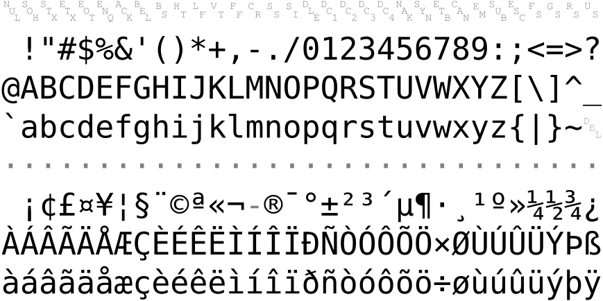
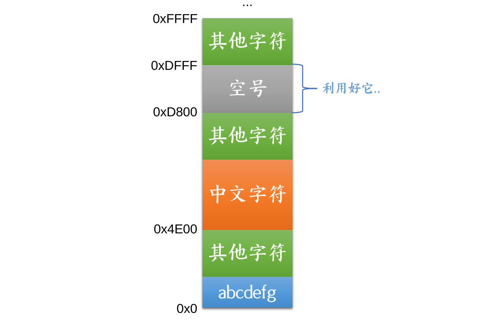

# 字符编码那些事

## 字符集

### ASCII

ASCII 为英文字母、阿拉伯数组、标点符号等 128 个字符，每个都用一个 0 到 127 范围内的数字对应。

如果你想要表示一个字符，就在这个表里寻找到相应的数字编号，然后存这个编号即可。


例如下面的一串数字：

```
80 101 110 103
```

在 ASCII 表中查找，发现这些数字分别对应 `P`、`e`、`n`、`g` 四个字母，连起来就还原得到了原本的字符串“Peng”。

### Latin-1

Latin-1 扩充了 ASCII 字符集，保持 ASCII 原有 0 到 127 的部分映射不变，额外追加了 128 到 255 的映射关系。因此也被称为 EASCII（扩展 ASCII）。



### Unicode

Unicode 字符集为全世界的所有字符都对应了一个整数。

|字符|编号|
|----|----|
|我|25105|
|戒|25106|
|戓|25107|
|戔|25108|
|戕|25109|
|或|25110|
|戗|25111|
|战|25112|
|戙|25113|
|戚|25114|

出于历史兼容性考虑，Unicode 在 0 到 256 区间内的映射和 ASCII、Latin-1 是完全相同的。

|字符|编号|
|----|----|
|P|80|
|e|101|
|n|110|
|g|103|

Unicode 经过了许多版本的发展，早期的 Unicode 只收录了 65536 (0x10000) 个字符，后来扩充到了 1114112 (0x110000) 个字符。

总之，现在 Unicode 字符映射的整数范围是 0x0 到 0x10FFFF。

> {{ icon.tip }} 虽然占用了 1114112 这多格码点空间，不过其中很多都是空号，留待未来扩充使用。

Unicode 字符映射表可以在网上找到：

- https://symbl.cc/en/unicode-table/
- https://www.compart.com/en/unicode/

### 总结

* 字符集: 从字符到整数的一一映射。
* ASCII: 只收录了英文字母、阿拉伯数字、标点符号的字符集。
* Latin-1: 在 ASCII 基础上追加了注音字母，满足欧洲用户需要。
* Unicode: 收录了全世界所有文字和符号的字符集。

计算机存储字符时，实际上是存储了那个对应的整数。

这些整数就被称为 **码点 (code point)**，每个字符对应一个码点。

不过，程序员通常喜欢用十六进制书写数字：

|字符|编号|
|----|----|
|我|0x6211|
|戒|0x6212|
|戓|0x6213|
|戔|0x6214|
|戕|0x6215|
|或|0x6216|
|戗|0x6217|
|战|0x6218|
|戙|0x6219|
|戚|0x621A|

例如“我”这个字，在 Unicode 表中编号为 0x6211。于是当计算机需要表示“我”这个字符时，就用 0x6211 这个整数代替。

如果要表示多个字符，那就用一个整数的数组吧！

例如当计算机要处理“我爱𰻞𰻞面!”这段文字，就可以用：

```
0x6211 0x7231 0x30EDE 0x30EDE 0x9762 0x21
```

这一串数字代替。

## 字符编码

Unicode 只是指定了整数，没有规定整数如何在内存中存在。

* 字符编码: 将字符的整数编号序列化为计算机可直接存储的一个或多个实际存在的整数类型。

Unicode 字符可以选用以下这些字符编码来序列化：

* UTF-32: 每个 Unicode 字符用 1 个 `uint32_t` 整数存储。
* UTF-16: 每个 Unicode 字符用 1 至 2 个 `uint16_t` 整数存储。
* UTF-8: 每个 Unicode 字符用 1 至 4 个 `uint8_t` 整数存储。

翻译出来的这些小整数叫 **码位 (code unit)**。例如对于 UTF-8 而言，每个 `uint8_t` 就是他的码位。

### UTF-32

Unicode 字符映射的整数范围是 0x0 到 0x10FFFF。

最大值 0x10FFFF 有 21 个二进制位，C 语言中 `uint32_t` 能容纳 32 个二进制位，所以最简单的方法是直接用 `uint32_t` 数组来一个个容纳 Unicode 字符码点。虽然浪费了 11 位，但至少所有 Unicode 字符都能安全容纳。

例如当计算机要存储“我爱𰻞𰻞面!”这段文字，就可以用：

```cpp
std::vector<uint32_t> s = {
    0x00006211, // 我
    0x00007231, // 爱
    0x00030EDE, // 𰻞
    0x00030EDE, // 𰻞
    0x00009762, // 面
    0x00000021, // !
};
```

这个数组表示。

UTF-32 中，一个码点固定对应一个码位，所以说 UTF-32 是**定长编码**。定长编码的优点是：

- 数组的长度，就是字符串中实际字符的个数。
- 要取出单个字符，可以直接用数组的索引操作。
- 无论对数组如何切片，都不会把一个独立的字符破坏。
- 反转数组，就可以把字符串反转，不会产生破坏字符的问题。

缺点是：

- 浪费存储空间。

因此，我们推荐在计算机内存中，始终采用 UTF-32 形式处理文字。

> {{ icon.tip }} UTF-32 也被称为 UCS-4，他俩是同义词。

### UTF-8

UTF-32 虽然方便了文字处理，然而，却浪费了大量的存储空间，不利于文字存储！一个字符，无论他是常用还是不常用，都要霸占 4 个字节的空间。

Unicode 编码字符时，特意把常用的字符靠前排列了。

世界上常用语言文字都被刻意编码在了 0 到 0xFFFF 区间内，超过 0x10000 的基本都是不常用的字符，例如甲骨文、埃及象形文字、Emoji 等，很多都是已经无人使用的古代文字和生僻字，例如“𰻞”。仅仅是为了这些偶尔使用的罕见文字，就要求所有文字都用同样的 4 字节宽度存储，实在是有点浪费。

在 0 到 0xFFFF 区间内，同样有按照常用度排序：

- 0 到 0x7F 是（欧美用户）最常用的英文字母、阿拉伯数字、半角标点。
- 0x80 到 0x7FF 是表音文字区，常用的注音字母、拉丁字母、希腊字母、西里尔字母、希伯来字母等。
- 0x800 到 0xFFFF 是表意文字，简繁中文、日文、韩文、泰文、马来文、阿拉伯文等。
- 0x10000 到 0x10FFFF 是不常用的稀有字符，例如甲骨文、埃及象形文字、Emoji 等。

UTF-8 就是为了解决压缩问题而诞生的。

UTF-8 把一个码点序列化为一个或多个码位，一个码位用 1 至 4 个 `uint8_t` 整数表示。

- 0 到 0x7F 范围内的字符，用 1 个字节表示。
- 0x80 到 0x7FF 范围内的字符，用 2 个字节表示。
- 0x800 到 0xFFFF 范围内的字符，用 3 个字节表示。
- 0x10000 到 0x10FFFF 范围内的字符，用 4 个字节表示。

序列化规则如下：

#### 0 到 0x7F

对于 0 到 0x7F 的字符，这个范围的字符需要 7 位存储。

我们选择直接存储其值。

例如 'P' 会被直接存储其 Unicode 值的 80（0x50）：

```
01010000
```

由于 Unicode 在 0 到 0x7F 范围内与 ASCII 表相同，而 UTF-8 又把 0 到 0x7F 的值直接存储，所以说 UTF-8 兼容 ASCII。这使得原本设计于处理 ASCII 的 C 语言函数，例如 strlen、strcat、sprintf 等，都可以直接无缝切换到 UTF-8。反之亦然，任何设计用于 UTF-8 的程序都可以完全接受 ASCII 格式的输入文本。

> {{ icon.detail }} 但部分涉及字符长度的函数会有些许不兼容，例如 strlen 求出的长度会变成字节的数量而不是字符的数量了，例如 `strlen("我们")` 会得到 6 而不是 2，稍后讲解。

#### 解码规则

UTF-8 的构造就像一列小火车一样，不同范围内的码位会被编码成不同长度的列车，但他们都有一个车头。

根据火车头的“等级”，我们可以推断出后面拉着几节车厢。

火车头是什么等级由他的二进制前缀决定：

+ 如果是 `0` 开头，就说明是单独一台火车头，后面没有车厢了，这表示车头里面直接装着 0 到 0x7F 范围的普通 ASCII 字符。
+ 如果是 `110` 开头，就说明后面拖着一节车厢，里面装着 0x80 到 0x7FF 范围内的欧洲字符。
+ 如果是 `1110` 开头，就说明后面拖着两节车厢，里面装着 0x800 到 0xFFFF 范围内的世界常用字符。
+ 如果是 `11110` 开头，就说明后面拖着三节车厢，里面装着 0x10000 到 0x10FFFF 范围内的生僻字符。
+ 如果是 `10` 开头，就说明这是一节车厢，车厢不会单独出现，只会跟在火车头屁股后面。如果你看到一节单独的车厢在前面无头驾驶，就说明出错了。

> {{ icon.fun }} 小朋友用小号列车装，大朋友用大号列车装。

例如下面这一串二进制：

```
11100110 10000010 10000001
```

首先，看到第一个字节，是 `1110` 开头的三级车头！说明后面还有两节车厢是属于他的。火车头中 4 位用于表示车头等级了，剩下还有 4 位用于装乘客。

车厢也有固定的前缀，所有的车厢都必须是 `10` 开头的。去除这开头的 2 位，剩下的 6 位就是乘客。

对于这种三级列车，4 + 6 + 6 总共 16 位二进制，刚好可以装得下 0xFFFF 内的乘客。

```
0110 000010 000001
```

编码时则是反过来。

乘客需要被拆分成三片，例如对于“我”这个乘客，“我”的码点是 0x6211，转换成二进制是：

```
110010000010001
```

把乘客切分成高 4 位、中 6 位和低 6 位：

```
1100 100000 10001
```

加上 `1110`、`10` 和 `10` 前缀后，形成一列火车：

```
11100110 10000010 10000001
```

这样，我们就把“我”这个字符，编码成了三节列车，塞进字节流的网络隧道里了。

总结：

+ 前缀是 0 的火车头：火车头直接载客 7 名。
+ 前缀是 10 的是车厢：车厢不会单独出现，只会跟在火车头屁股后面。
+ 前缀是 110 的火车头：火车头直接载客 5 名 + 1 节车厢载客 6 名 = 共 11 名。
+ 前缀是 1110 的火车头：火车头直接载客 4 名 + 2 节车厢各载客 6 名 = 共 16 名。
+ 前缀是 11110 的火车头：火车头直接载客 3 名 + 3 节车厢各载客 6 名 = 共 21 名。

> {{ icon.fun }} 高级车头装了防弹钢板，载客空间变少，只好匀到后面的车厢。

#### UTF-8 的抗干扰机制

如果发现 `10` 开头的独立车厢，就说明出问题了，可能是火车被错误拦腰截断，也可能是字符串被错误地反转。因为 `10` 只可能是火车车厢，不可能出现在火车头部。此时解码器应产生一个报错，或者用错误字符“�”替换。

```
10000010 10000001
```

> {{ icon.tip }} 在网络收发包时，如果你不妥善处理 TCP 粘包问题，就可能火车头进去了，火车尾巴还露在隧道外面，一段完整的列车被切断，导致 UTF-8 解读的时候出错。正确的做法是设立一个状态机来解码 UTF-8。C 语言的 `mbstate_t` 就是这种状态机，稍后讲解。

除此之外，如果检测到一个三级火车头，却发现里面装着 0x394 (“Δ”)，这是一个用二级火车头就能装下的欧洲字符，却用了三级火车头装，说明装箱那边的人偷懒滥用资源了！这种情况下 UTF-8 解码器也要产生一个报错，因为 UTF-8 要保证编码的唯一性，0x394 是 0x7F 到 0x7FF 范围的，就应该用二级火车头装。

以及，如果发现 `11111` 开头的五级火车头，也要报错，因为 UTF-8 最多只支持四级火车头。

如果检测到一个四级火车头拆开后的字符范围超过了 0x10FFFF，这超出了 Unicode 的范围，也要产生一个报错。如果一个三级火车头拆开后发现字符范围处在保留区 0xD800 到 0xDFFF 内，这是 Unicode 承诺永不加入字符的区间（稍后讲解 UTF-16 时会解释为什么），也要报错。总之 Unicode 码点的合法范围是 0x0 到 0xD7FF，0xE000 到 0x10FFFF。

总之，UTF-8 具有一定的冗余和自纠错能力，如果传输过程中出现差错，可能会爆出错误字符“�”。这个特殊字符是 Unicode 官方规定的，码点为 0xFFFD，出现他就意味着 UTF-8 解码失败了。

#### “我爱𰻞𰻞面!”

例如当计算机要以 UTF-8 格式存储“我爱𰻞𰻞面!”这段文字：

```cpp
std::vector<uint8_t> s = {
    0xE6, 0x88, 0x91, // 我，需要三级列车
    0xE7, 0x88, 0xB1, // 爱，需要三级列车
    0xF0, 0xB0, 0xAF, 0x9B, // 𰻞，需要四级列车
    0xF0, 0xB0, 0xAF, 0x9B, // 𰻞，需要四级列车
    0xE9, 0x9D, 0xA2, // 面，需要三级列车
    0x21, // !，这是个 ASCII 范围的字符，直接用单个火车头装
};
```

UTF-8 中，一个码点可能对应多个码位，所以说 UTF-8 是一种**变长编码**。变长编码的缺点是：

- 数组的长度，不一定是字符串中实际字符的个数。因此，要取出单个字符，需要遍历数组，逐个解析码位。
- 数组的单个元素索引，无法保证取出一个完整的字符。
- 对数组的切片，可能会把一个独立的字符切坏。
- 反转数组，不一定能把字符串的反转，因为可能不慎把一个字符的多个码位反转，导致字符破坏。

优点是：

- 节约存储空间。

我们推荐只在网络通信、硬盘存储时，采用 UTF-8 形式存储文字。

总之，UTF-8 适合存储，UTF-32 适合处理。

我们建议计算机从硬盘或网络中读出 UTF-8 字符串后，立即将其转换为 UTF-32，以方便后续文字处理。当需要写入硬盘或网络时，再转换回 UTF-8，避免硬盘容量和网络带宽的浪费。

计算机需要外码和内码两种：

+ 外码=硬盘中的文本=UTF-32
+ 内码=内存中的文本=UTF-8

### UTF-16

UTF-16 的策略是：既然大多数常用字符的码点都在 0x0 到 0xFFFF 内，用 `uint32_t` 来存储也太浪费了。他的方案如下：

对于 0x0 到 0xFFFF 范围内的字符，就用一个 `uint16_t` 直接存。

对于 0xFFFF 到 0x10FFFF 范围的稀有字符，反正不常见，就拆成两个 `uint16_t` 存。这个拆的方案很有讲究，如果只是普通的拆，由于解码时收到的是个没头没尾的字节序列，无法分辨这到底是两个 `uint16_t` 的稀有字符，还是一个 `uint16_t` 的普通字符。

例如，我们把一个稀有字符“𰻞”，0x30EDE。拆成两个 `uint16_t`，得到 0x3 和 0x0EDE。如果直接存储这两个 `uint16_t`：

```
0x0003 0x0EDE
```

之后解码时，先读到 0x0003，还会以为他是单独的一个 `uint16_t`，表示 3 号字符“”。后面的 0x0EDE 就变成了一个单独的 0x0EDE，变成了 0x0EDE 号字符 “ໞ”。这样一来，“𰻞”就变成了两个毫不相干的字符，“ໞ”了。

为了避免与普通字符产生歧义，两个 `uint16_t` 需要采用一种特殊的方式以示区分。让解码器一看到，就能确定这两个 `uint16_t` 需要组装成同一个字符。

这就用到了一个“漏洞”：Unicode 并没有把码点分配的满满当当，或许是出于先见之明，在 0xD800 到 0xDFFF 之间预留了一大段空号：



UTF-16 就是利用了这一段空间，他规定：0xD800 到 0xDFFF 之间的码点将永远不用来表示字符，而是作为**代理对 (surrogate-pair)**。其中  0xD800 到 0xDBFF 是**高位代理 (high surrogate)**，0xDC00 到 0xDFFF 是**低位代理 (low surrogate)**。高代理在前，低代理在后。

一个超过 0xFFFF 的稀有字符，会被拆成两段，一段放在高位代理里，一段放在低位代理里，一前一后放入 `uint16_t` 序列中。

> {{ icon.fun }} 搭载超宽超限货物的车辆需要被拆分成两段再进入隧道。

具体拆分方法如下：

对于 0xFFFF 到 0x10FFFF 范围的码点，首先将其值减去 0x10000，变成一个范围 0x0 到 0xFFFFF 范围内的数字，这能保证他们只需 20 个二进制位即可表示。

例如“𰻞”对应的码点 0x30EDE，减去后就变成 0x20EDE。

然后，写出 0x20EDE 的二进制表示：

```
00100000111011011110
```

总共 20 位，我们将其拆成高低各 10 位：

```
0010000011 1011011110
```

各自写出相应的十六进制数：

```
0x083 0x2DE
```

因为最多只有 10 位，这两个数都会在 0 到 0x3FF 的范围内。

而 0xD800 到 0xDBFF，和 0xDC00 到 0xDFFF 预留的空间，刚好可以分别容纳 0x400 个数！

所以，我们将拆分出来的两个 10 位数，分别加上 0xD800 和 0xDC00：

```
0xD800+0x083=0xD883
0xDC00+0x2DE=0xDFDE
```

这两个数，必定是 0xD800 到 0xDBFF，和 0xDC00 到 0xDFFF 范围内的数。而这两个范围都是 Unicode 委员会预留的代理对区间，绝对没有普通字符。所以，生成的两个代理对不会与普通字符产生歧义，可以放心放进 `uint16_t` 数组，解码器如果检测到代理对，就说明是两节车厢，可以放心连续读取两个 `uint16_t`。

所以，`0xD883 0xDFDE` 就是“𰻞”用 UTF-16 编码后的结果。

代理字符不是一个完整的字符，当解码器检测到一个 0xD800 到 0xDBFF 范围内的高代理时，就预示着还需要再读取一个低代理，才能拼接成一个稀有字符。

如果接下来读到的不是 0xDC00 到 0xDFFF 范围的低代理字符，而是普通字符的话，那就说明出错了，可能是中间被人丢包了，需要报错或者用错误字符“�”顶替。

另外，如果读到了一个单独存在的 0xD800 到 0xDFFF 范围内的低代理字符，那也说明出错了，因为代理字符只有成对出现才有意义，低代理字符不可能单独在开头出现。

可见，UTF-16 和 UTF-8 一样，都是“小火车”式的变长编码，UTF-16 同样也有着类似于 UTF-8 的抗干扰机制。

### 字节序问题，大小端之争

在计算机中，多字节的整数类型（如 `uint16_t` 和 `uint32_t`）需要被拆成多个字节来存储。拆开后的高位和低位按什么顺序存入内存？不同的硬件架构产生了争执：

- 大端派 (bit endian)：低地址存放整数的高位，高地址存放整数的低位，也就是大数靠前！这样数值的高位和低位和人类的书写习惯一致。例如，0x12345678，在内存中就是：

```
0x12 0x34 0x56 0x78
```

- 小端派 (little endian)：低地址存放整数的低位，高地址存放整数的高位，也就是小数靠前！这样数值的高位和低位和计算机电路的计算习惯一致。例如，0x12345678，在内存中就是：

```
0x78 0x56 0x34 0x12
```

例如，Intel 的 x86 架构和 ARM 公司的 ARM 架构都是小端派，而 Motorola 公司的 68k 架构和 Sun 公司的 SPARC 架构都是大端派。

> {{ icon.tip }} 这其实是很无聊的争执，为人类的书写习惯改变计算机的设计毫无道理，毕竟世界上也有从右往左书写的文字和从上往下书写的文字，甚至有左右来回书写的文字……如果要伺候人类，你怎么不改成十进制呢？总之，我认为小端才是最适合计算机的，市面上大多数主流硬件都是小端架构。

在网络通信时，发消息和收消息的可能是不同的架构，如果发消息的是小端架构，收消息的是大端架构，那么发出去的是 0x12345678，收到的就会变成 0x78563421 了。

因此互联网一般规定，所有多字节的数据在网络包中统一采用大端。对于大端架构，他们什么都不需要做，对于小端架构，在发包前需要把自己的小端数据做字节序反转，变成大端的以后，再发送。之后的网络专题课中我们会详解这一块。

> {{ icon.story }} 基于字节码的虚拟机语言通常会规定一个字节序：像 Java 这种面向互联网语言，索性也规定了统一采用大端，无论 JVM 运行在大端机器还是小端机器上。这使得他与互联网通信比较方便，而在 x86 和 ARM 架构上，与本地只接受小端数据的 API，例如 OpenGL，沟通较为困难，需要做额外的字节序转换。而 C\# 主打游戏业务（例如 Unity），需要考虑性能，所以规定全部采用小端。作为底层编程语言的 C++ 则是入乡随俗，你的硬件是什么端，他就是什么端，不主动做任何额外的转换。

UTF-16 和 UTF-32 的码位都是多字节的，也会有大小端问题。例如，UTF-16 中的 `uint16_t` 序列：

```
0x1234 0x5678
```

在大端派的机器中，就是：

```
0x12 0x34 0x56 0x78
```

在小端派的机器中，就是：

```
0x34 0x12 0x78 0x56
```

这样一来，UTF-16 和 UTF-32 的字节流，在不同的机器上，可能会有不同的顺序。这给跨平台的文本处理带来了麻烦。

所以当你需要把 UTF-16 存入硬盘和在网络发送时，还需要额外指明你用的是大端的 UTF-16 还是小端的 UTF-16。

因此 UTF-16 和 UTF-32 进一步分裂为：

- UTF-16LE：小端的 UTF-16
- UTF-16BE：大端的 UTF-16
- UTF-32LE：小端的 UTF-32
- UTF-32BE：大端的 UTF-32

如果只在内存的 `wchar_t` 中使用就不用区分，默认跟随当前机器的大小端。所以 UTF-16 和 UTF-32 通常只会出现在内存中用于快速处理和计算，很少用在存储和通信中。

UTF-8 是基于单字节的码位，火车头的顺序也有严格规定，火车头总是在最前，根本不受字节序大小端影响，也就没有影响。

由于压缩率低，又存在大小端字节序不同的问题。而互联网数据需要保证相同的大小端，在收发包时需要额外转换，因而可能不太适合网络。而 UTF-8 的存储单位是字节，天生没有大小端困扰。更妙的是，他且完全兼容 ASCII，而互联网又是古董中间件最多的地方……

总之，完全基于字节的 UTF-8 是最适合网络通信和硬盘存储的文本编码格式，而 UTF-32 是最适合在内存中处理的格式。

### BOM 标记

0xFEFF 是一个特殊的不可见字符“”，这是一个零宽空格，没有任何效果。

你可以把这个字符加在文本文件的头部，告诉读取该文件的软件，这个文件是用什么编码的。

如果是 UTF-16 和 UTF-32，因为 0xFEFF 不对称，他还能告诉你是大端还是小端。因此 0xFEFF 被称为字节序标志（Byte-order-mark，BOM）。

如果读取该文件的软件不支持解析 BOM，那么他照常读出 0xFEFF，一个零宽空格，在文本中不显示，不影响视觉结果。

> {{ icon.story }} 一些老的编译器（远古 MinGW，现在已经没有了）不支持解析 BOM，会把带有 BOM 的 UTF-8 的 .cpp 源码文件，当作头部带有错误字符的乱码文件，从而报错。这是因为 Windows 的记事本保存为 UTF-8 时，总是会加上 BOM。如果记事本发现一个文件没有 BOM，会当作 ANSI（GBK）来读取。

0xFEFF 在不同的编码下会产生不同的结果：

+ UTF-8：`0xEF 0xBB 0xBF`，他会占用 3 字节，而且不会告诉你是大端还是小端，因为 UTF-8 是没有大小端问题的。
+ UTF-16：如果是大端，就是 `0xFE 0xFF`，如果是小端，就是 `0xFF 0xFE`。
+ UTF-32：如果是大端，就是 `0x00 0x00 0xFE 0xFF`，如果是小端，就是 `0xFF 0xFE 0x00 0x00`。

因此，在文本头部加上 BOM 有助于软件推测该文件是什么编码的（如果那软件支持解析 BOM 的话）。

> {{ icon.story }} 例如 Windows 环境中，所有的文本文件都被默认假定为 ANSI（GBK）编码，如果你要保存文本文件为 UTF-8 编码，就需要加上 BOM 标志。当 MSVC 读取时，看到开头是 `0xEF 0xBB 0xBF`，就明白这是一个 UTF-8 编码的文件。这样，MSVC 就能正确地处理中文字符串常量了。如果 MSVC 没看到 BOM，会默认以为是 ANSI（GBK）编码的，从而中文字符串常量会乱码。开启 `/utf-8` 选项也能让 MSVC 把没有 BOM 的源码文件当作 UTF-8 来解析，适合跨平台宝宝体质。

## C/C++ 中的字符

### 字符类型

|类型|大小|编码|字面量|
|---|---|---|---|
|Linux `char`|1 字节|取决于 `$LC_ALL`|"hello"|
|Windows `char`|1 字节|取决于系统区域设置|"hello"|
|Linux `wchar_t`|4 字节|UTF-32|L"hello"|
|Windows `wchar_t`|2 字节|UTF-16|L"hello"|
|`char8_t`|1 字节|UTF-8|u8"hello"|
|`char16_t`|2 字节|UTF-16|u"hello"|
|`char32_t`|4 字节|UTF-32|U"hello"|

由此可见，`char` 和 `wchar_t` 是不跨平台的。

对于中国区 Windows 来说，区域设置默认是 GBK。对于美国区 Windows 来说，区域设置默认是 UTF-8。

对于 Linux 用户来说，如果你没有专门修改过，`$LC_ALL` 默认是 `en_US.UTF-8` 或 `C.UTF-8`。

这带来了巨大的混淆！很多美国程序员潜意识里会想当然地把 `char` 当作 UTF-8 来用。很多开源项目，第三方库，甚至很多国人做的项目，都被这种“想当然”传染了。

> {{ icon.tip }} 好消息是无论“区域设置”是什么，肯定兼容 ASCII。例如 GBK 和 UTF-8 都兼容 ASCII，否则就和所有的 C 语言经典函数如 `strlen`，换行符 `'\n'`，路径分隔符 `'/'` 和 `'\\'` 冲突了。

`wchar_t` 就好一些，虽然在 Windows 系统上是糟糕的 UTF-16，但至少稳定了，不会随着系统区域设置而随意改变，只要你不打算跨平台，`wchar_t` 就是 Windows 程序的标配。

### 思考：UTF-8 为什么完美兼容 ASCII

UTF-8 的火车头和车厢，都是 `1` 开头的，而 ASCII 的单体火车头永远是 `0` 开头。这很重要，不仅火车头需要和 ASCII 区分开来，车厢也需要。考虑这样一个场景：

```cpp
std::u32string path = "一个老伯.txt";
```

“一个老伯” 转换为 Unicode 码点分别是：

```
0x4E00 0x4E2A 0x8001 0x4F2F
```

如果让他们原封不动直接存储进 char 数组里：

```
0x4E 0x00 0x4E 0x2A 0x80 0x01 0x4F 0x2F
```

就出问题了！首先，这里 0x4E00 的 0x00 部分，会被 C 语言当作是字符串的结尾。如果拿这样的字符串去调用操作系统的 open 函数，他会以为你在打开 0x4E 单个字符的文件名，也就是 `"N"`。

更糟糕的是，0x2F 对应的 ASCII 字符是 `'/'`，是路径分隔符。操作系统会以为你要创建一个子文件夹下的文件 `"N\x00N*\x80\x01O/.txt"`，文件夹名字叫 `"N\x00N*\x80\x01O"` 而文件叫 `".txt"`。

为了能让针对 ASCII 设计的操作系统 API 支持中文文件名，就只能绕开所有 0x7F 以下的值。这就是为什么 UTF-8 对车厢也全部抬高到 0x80 以上，避免操作系统不慎把车厢当作是 `'/'` 或 `'\0'`。

### UTF-8 确实几乎完美支持字符串所有操作

由于巨大的惯性，很多人都想当然的把 `std::string` 当作 UTF-8 来使用。对于简单的打印，常规的字符串操作，是没问题的。

字符串操作有下面这几种，得益于 UTF-8 优秀的序列化涉及和冗余抗干扰机制，绝大多数 ASCII 支持的操作，UTF-8 字符串都能轻松胜任，唯独其中**涉及“索引”和“长度”的**一部分操作不行。这是由于变长编码的固有缺陷，如果需要做“索引”类操作，还是建议先转换成定长的 UTF-32 编码。

|操作|UTF-8|UTF-32|GBK|
|---|---|---|---|
|求字符串长度|×|√|×|
|判断相等|√|√|√|
|字典序的大小比较|√|√|×|
|字符串拼接|√|√|√|
|搜索子字符串|√|√|×|
|搜索单个字符|×|√|×|
|按索引切下子字符串|×|√|×|
|按索引获取单个字符|×|√|×|
|遍历所有字符|×|√|×|
|按子字符串切片|√|√|×|
|按索引切片|×|√|×|
|查找并替换子字符串|√|√|×|
|查找并删除子字符串|√|√|×|
|按索引删除子字符串|×|√|×|
|删除单个字符|×|√|×|

为什么？我们来看一个实验：

```cpp
std::string s = "你好";
fmt::println("s 的长度：{}", s.size());
```

（使用 `/utf-8` 编译）运行后，会得到 6。

因为 `std::string` 的 `size()` 返回的是 `char` 的数量，而不是真正字符的数量。在 UTF-8 中，一个非 ASCII 的字符会被编码为多个 `char`，对于中文而言，中文都在 0x2E80 到 0x9FFF 范围内，属于三级列车，也就是每个汉字会被编码成 3 个 `char`。

`char` 是字节（码位）而不是真正的字符（码点）。真正的 Unicode 字符应该是 `char32_t` 类型的。调用 `std::string` 的 `size()` 或者 `strlen` 得到的只是“字节数量”。

而 UTF-32 中，每个字符（码点）都对应一个独立的 `char32_t`（码位），`size()` 就是真正的“字符数量”，这就是定长编码的优势。

```cpp
std::u32string s = U"你好";
fmt::println("s 的长度：{}", s.size());
```

如果你的操作只涉及字符串查拼接与查找，那就可以用 UTF-8。如果大量涉及索引，切片，单个字符的操作，那就必须用 UTF-32（否则一遇到汉字就会出错）。

```cpp
std::vector<std::string> slogan = {
    "小彭老师公开课万岁", "全世界程序员大团结万岁",
};
std::string joined;
for (auto const &s: slogan) {
    joined += s; // 只是拼接而已，UTF-8 没问题
}
```

UTF-8 按索引切片的出错案例：

```cpp
std::string s = "小彭老师公开课万岁";
fmt::println("UTF-8 下，前四个字节：{}", s.substr(0, 4));
// 会打印 “小�”
```

```cpp
std::u32string s = U"小彭老师公开课万岁";
fmt::println("UTF-32 下，前四个字符：{}", s.substr(0, 4));
// 会打印 “小彭老师”
```

只有当索引来自 `find` 的结果时，UTF-8 字符串的切片才能正常工作：

```cpp
std::string s = "小彭老师公开课万岁";
size_t pos = s.find("公"); // pos = 12
fmt::println("UTF-8 下，“公”前的所有字节：{}", s.substr(0, pos));
// 会打印 “小彭老师”
```

```cpp
std::u32string s = U"小彭老师公开课万岁";
size_t pos = s.find(U'公'); // pos = 4
fmt::println("UTF-32 下，“公”前的所有字符：{}", s.substr(0, pos));
// 会打印 “小彭老师”
```

> {{ icon.tip }} 注意到这里 UTF-8 的 `"公"` 需要是字符串，而不是单个字符。

UTF-8 无法取出单个非 ASCII 字符，对于单个中文字符，仍然只能以字符串形式表达（由多个字节组成）。

```cpp
std::string s = "小彭老师公开课万岁";
fmt::print("UTF-8 下第一个字节：{}", s[0]);
// 可能会打印 ‘å’ (0xE5)，因为“小”的 UTF-8 编码是 0xE5 0xB0 0x8F
// 也可能是乱码“�”，取决于终端理解的编码格式
```

```cpp
std::u32string s = U"小彭老师公开课万岁";
fmt::print("UTF-32 下第一个字符：{}", s[0]);
// 会打印 ‘小’
```

UTF-8 字符串的反转也会出问题：

```cpp
std::string s = "小彭老师公开课万岁";
strrev(s.data()); // 会以字节为单位反转，导致乱码
```

```cpp
std::u32string s = U"小彭老师公开课万岁";
strrev(s.data()); // 会把按字符正常反转，得到 “岁万课开公师老彭小”
```

**总结：UTF-8 只能拼接、查找、打印。不能索引、切片、反转。**

> {{ icon.tip }} 按索引切片不行，但如果索引是 find 出来的就没问题。

### 轶事：“ANSI” 与 “Unicode” 是什么

在 Windows 官方的说辞中，有“Unicode 编码”和“ANSI 编码”的说法。当你使用 Windows 自带的记事本程序，保存文本文件时，就会看到这样的选单：


翻译一下：

- “ANSI”指的是“区域设置”里设置的那个编码格式。
- 所谓“Unicode”其实指的是 UTF-16。
- 所谓“Unicode big endian”指的是大端 UTF-16。
- “UTF-8”指的是 UTF-8 with BOM 而不是正常的 UTF-8。

实际上 Unicode 只是一个字符集，只是把字符映射到整数，更没有什么大端小端，UTF-16 才是编码格式。

而 ANSI 本来应该是 ASCII 的意思，`char` 本来就只支持 ASCII。

但由于当时各国迫切需要支持自己本国的文字，就在兼容 ASCII 的基础上，发展出了自己的字符集和字符编码。这些当地特供的字符集里只包含了本国文字，所有这些各国的字符编码也都和 UTF-8 类似，采用火车头式的变长编码，对 0 开头的 ASCII 部分也都是兼容。所以 Windows 索性把 ANSI 当作“各国本地文字编码”的简称了。但后来互联网的出现，“区域设置”带来了巨大的信息交换困难。

> {{ icon.fun }} 例如你在玩一些日本的 galgame 时，会发现里面文字全部乱码。这是因为 Windows 在各个地区发行的是“特供版”：在中国大陆地区，他发行的 Windows 采用 GBK 字符集，在日本地区，他发行的 Windows 采用 Shift-JIS 字符集。日本程序员编译程序时，程序内部存储的是 Shift-JIS 的那些“整数”。这导致日本的 galgame 在中国大陆特供的 Windows 中，把 Shift-JIS 的“整数”用 GBK 的表来解读了，从而乱码（GBK 里的日文区域并没有和 Shift-JIS 重叠）。需要用 Locale Emulator 把 Shit-JIS 翻译成 Unicode 读给 Windows 听。如果日本程序员从一开始就统一用 Unicode 来存储，中国区玩家的 Windows 也统一用 Unicode 解析，就没有这个问题。

这种情况下，Unicode 组织出现了，他的使命就是统一全世界的字符集，保证全世界所有的文字都能在全世界所有的计算机上显示出来。首先创办了 Unicode 字符集，然后规定了 UTF-8、UTF-16、UTF-32 三种字符编码，最终 UTF-8 成为外码的主流，UTF-32 成为内码的主流。

接下来为了方便记忆，我们索性就顺着微软的这个说法：

- 管 `char` 叫 ANSI：随“区域设置”而变。
- 管 `wchar_t` 叫 Unicode：在 Windows 上是 UTF-16，在 Linux 上是 UTF-32。

### 小笑话：UTF-16 的背刺

微软管 UTF-16 叫 Unicode 是纯粹的历史遗留问题：

因为当年 Unicode 5.0 的时候只有 0 到 0xFFFF 的字符，16 位就装得下，所以当时 UTF-16 还是一个**定长编码**。微软于是决定把 `wchar_t` 定义成 2 字节，并在 NT 内核中，为每个系统调用都升级成了基于 `wchar_t` 字符串的 “W 系” API。

比尔盖子当时以为这样 UTF-16 定长内码就一劳永逸了，并号召所有程序都改用 UTF-16 做内码，别用 “A 系” API 了。

> {{ icon.fun }} 起初，所有人都以为 UTF-16 就是最终答案。

没想到后来 Unicode 委员会“背刺”了比尔盖子！偷偷把范围更新到了 0x10FFFF，突破了 16 位整数的容量。原来的 UTF-16 已经容纳不下，只好利用之前预留的 0xD800 到 0xDFFF 空号区间丑陋地实现了变长编码。

> {{ icon.fun }} 直到 UTF-16 一夜之间成了丑陋的**变长编码**。

闹了半天，Windows 费心费力替 Unicode 委员会好不容易推广的 `wchar_t`，既没有 UTF-8 兼容 ASCII 的好处，又没有 UTF-32 **定长编码**的好处。可 “W 系” API 却又焊死在了 NT 内核最底层，反复来坑第一次用 Windows 编程的初学者。

> {{ icon.fun }} 比尔盖子：你这样显得我很小丑诶？

除 Windows 外，Java 也是“UTF-16 背刺”的受害者，他们想当然的把 char 定义为 UTF-16，以为这就是未来永久的定长内码，一劳永逸…… 直到 Unicode 加入了 0x10FFFF，Java 不得不重新定义了个 Character 作为 UTF-32 字符，还弄个 char 到 Character 的转换，好不尴尬！

> {{ icon.fun }} Linux 成立于 1991 年，当时 Unicode 也才刚刚出现。Unicode 宣布加入 0x10FFFF 后，Linux 才开始引入支持 Unicode。在知道了 Unicode 包含 0x10FFFF 后，他们一开始就把 `wchar_t` 定义成 4 字节，逃过了 UTF-16 的背刺。

> {{ icon.tip }} 后来新出的语言，如 Python 3、Go、Rust、Swift、Kotlin，把字符钦定为 UTF-32 了。他们只有在调用 Windows API 时，才会临时转换为 UTF-16 来调用，除此之外再无 UTF-16 出现。

> {{ icon.fun }} 许多糟糕的博客声称：是因为“UTF-16 最有利于中文压缩”，所以 Java 和 Windows 才采用的？然而就我了解到的实际情况是因为他们错误的以为 0xFFFF 是 Unicode 的上限才错误采用了，不然为什么后来的新语言都采用了 UTF-32 内码 + UTF-8 外码的组合？而且在外码中采用 UTF-8 或 UTF-16 压缩确实没问题，但是 Java 和 Windows 的失误在于把 UTF-16 当作内码了！内码就理应是定长编码的才方便，如果你有不同想法，欢迎留言讨论。

总之，UTF-16 是糟粕，但他是 Windows 唯一完整支持的 Unicode 接口。不建议软件内部用 UTF-16 存储文字，你可以用更紧凑的 UTF-8 或更方便切片的 UTF-32，只需在调用操作系统 API 前临时转换成 UTF-16 就行。

### 强类型系统只是君子协议

必须指出：在 `std::string` 中装 UTF-8 并不是未定义行为，在 `std::u8string` 里同样可以装 GBK。这就好比一个名叫 `Age` 的枚举类型，实际却装着性别一样。

```cpp
enum Age { // 错误示范
    Male,
    Female,
    Custom,
};
// 除了迷惑同事外，把年龄和性别的类型混用没有好处
void registerStudent(Age age, Age sex);
```

区分类型只是大多数人设计接口的规范，只是方便你通过看函数接口一眼区分这个函数接受的是什么格式的字符串，并没有强制性。例如下面这段代码一看就知道这些函数需要的是什么编码的字符串。

```cpp
void thisFuncAcceptsANSI(std::string msg);
void thisFuncAcceptsUTF8(std::u8string msg);
void thisFuncAcceptsUTF16(std::u16string msg);
void thisFuncAcceptsUnicode(std::wstring msg);
void thisFuncAcceptsUTF32(std::u32string msg);
```

用类型别名同样可以起到差不多的说明效果（缺点是无法重载）：

```cpp
using ANSIString = std::string;
using UTF8String = std::string;
using UTF16String = std::vector<uint16_t>;
void thisFuncAcceptsANSI(ANSIString msg);
void thisFuncAcceptsUTF8(UTF8String msg);
void thisFuncAcceptsUTF16(UTF16String msg);
```

之所以我会说，`std::string` 应该装 ANSI 字符串，是因为所有标准库官方提供的函数，都会假定 `std::string` 类型是 ANSI 编码格式（GBK）。并不是说，你不能用 `std::string` 存其他编码格式的内容。

如果你就是想用 `std::string` 装 UTF-8 也可以，只不过你要注意在传入所有使用了文件路径的函数，如 `fopen`，`std::ifstream` 的构造函数前，需要做一个转换，转成 GBK 的 `std::string` 或 UTF-16 的 `std::wstring` 后，才能使用，很容易忘记。

而如果你始终用 `std::u8string` 装 UTF-8，那么当你把它输入一个接受 ANSI 的普通 `std::string` 参数时，就会发生类型不匹配错误，强迫你重新清醒，或是强迫你使用一个转换函数，稍后会介绍这个转换函数的写法。

例如当你使用 `std::cout << u8string` 时会报错，迫使你改为 `std::cout << u8toansi(u8string)` 才能编译通过，从而避免了把 UTF-8 的字符串打印到了只支持 GBK 的控制台上。

> {{ icon.detail }} 其中转换函数签名为 `std::string u8toansi(std::u8string s)`，很可惜，标准库并没有提供这个函数，直到 C++26 前，标准库对字符编码支持一直很差，你不得不自己实现或依赖第三方库。

#### u8 字符串常量转换问题

`char8_t` 是 C++20 引入的新字符类型，用于强类型的君子协议，和 `char` 并没有实际区别。只是方便了函数类型签名更加一目了然，这个参数只能接受 UTF-8 编码的字符串！

## 选择你的阵营！


### ANSI 阵营

把字符串当作纯粹的“字节流”，无视字符编码。或者说，你从系统输入进来的是什么编码，我就存储的什么编码。对于 Unicode 则采取完全摆烂的态度，完全无视 Unicode 的存在。

- 适用场景：通常与文字处理领域无关的软件会采取这种方案。
- 优点：方便，且内部对字符串无任何转换和判断，效率最高。
- 缺点：在调用 Windows 系统 API，读写带有中文的文件路径时，会饱受乱码和找不到文件的困扰。
- 方法：完全使用 `const char *` 和 `std::string`。
- 代表作：Linux 文件系统 ext4、Lua 编程语言、现代 Python 中的 `bytes` 类型、HTTP 的 `?` 参数、早期 FAT32 文件系统等。

这类软件是最常见的初学者写法，如果你从未想过字符编码问题，从不了解 `wchar_t`、`char32_t` 之间的战争，只知道 `char`，那么你已经自动在此阵营里。

> {{ icon.detail }} 有人说 Linux 文件系统是 UTF-8？并不是！Linux 文件系统根本不会检验你的文件名是不是合法的 UTF-8，只不过是因为你设定了 `export LC_ALL=zh_CN.UTF-8`，这会使所有程序（包括终端模拟器）假定文件名和文件内容都按 UTF-8 编码，从而调用操作系统各类 API 时（如 open、write）都会使用 UTF-8 编码的 `const char *` 输入，在 Linux 系统 API 看来，所谓“文件名”只是纯粹的字节流，只要保证不包含 `'/'` 和 `'\0'`，无论你是什么编码，他都不在乎。而所有的 locale 都兼容 ASCII，所以绝不会出现一个中文汉字编码后产生 `'/'` 的情况（例如 GB2312 会把一个中文编码成两个 0x80 到 0xFF 区间的字节，和 ASCII 的范围没有重叠，更不可能出现 `'/'`），即使换成 `export LC_ALL=zh_CN.GB2312`，Linux 文件系统一样能正常工作，只不过读取你之前以 UTF-8 写入的文件会变成乱码而已。

对于中国区的 Windows 而言，他的所有 A 函数只支持 GBK 编码。这意味着如果你 Lua 中把字符串“当作” UTF-8 来用。那么当你在调用 Lua 的 io.open 前，需要先做一个 UTF-8 到 GBK 的转换，这还会导致丢失部分不在 GBK 内的字符，比如如果你的文件名包含 Emoji，那就会变成 `???` 乱码。而使用 W 函数的 UTF-16 就不会，因为 UTF-16 能容纳完整的 Unicode 映射。而完全摆烂的 Lua，其 `io.open` 只是使用 C 语言库函数 `fopen`，`fopen` 又是基于 Windows 的 A 系列函数，Lua 又没有提供对 Windows C 运行时库特有的 `_wfopen` 函数的封装，从而永远不可能打开一个带有 Emoji 的文件。

**总结：要支持 ANSI 阵营，你什么都不需要做，char 满天飞摆烂。**

### UTF-8 阵营

支持 Unicode，字符串统一以 UTF-8 形式存储、处理和传输。

- 应用场景：常见于文字处理需求不大，但有强烈的跨平台需求，特别是互联网方面的软件。他们通常只用到字符串的拼接、查找、切片通常也只是在固定的位置（例如文件分隔符 `'/'`）。也非常适合主要面对的是以 ASCII 为主的“代码”类文本，UTF-8 是对英文类文本压缩率最高的，所以也广泛用于编译器、数据库之类的场景。同时因为 UTF-8 完全兼容 ASCII，使得他能轻易适配远古的 C 语言程序和库。
- 方法：始终以 UTF-8 编码存储和处理字符串。
- 优点：跨平台，在网络传输时无需任何转码，UTF-8 是互联网的主流编码格式，不同平台上运行的 UTF-8 软件可以随意共享文本数据。兼容 ASCII，方便复用现有库和生态。对英文类文本压缩率高，对中文文本也不算太差。
- 缺点：对于底层 API 均采用 UTF-16 的 Windows 系统，需要进行字符编码转换，有少量性能损失。且字符串的正确切片、求长度等操作的复杂度会变成 $O(N)$ 而不是通常的 $O(1)$。
- 代表作：Rust 语言、Go 语言、CMake 构建系统、Julia 语言等。

在 C++ 中，可以通过 `u8"你好"` 创建一个保证内部是 UTF-8 编码的字符串常量，类型为 `char8_t []`。

如果用无前缀的 `"你好"` 创建，则 MSVC 默认会以编译者所在系统的“区域设置 (locale)” 作为字符串常量的编码格式（而不是运行者的区域设置！），开启 `/utf-8` 选项可以让 MSVC 编译器默认采用 UTF-8 编码，即让 `"你好"` 和 `u8"你好"` 一样采用 UTF-8。而 GCC 默认就是 UTF-8，除非手动指定 `-fexec-charset=GBK` 来切换到 GBK。稍后会详细讨论编译器的字符编码问题。

假设你通过 `/utf-8` 或 `-fexec-charset=utf-8` 搞定了编译期常量字符串的编码。接下来还有一个问题，文件系统。

Linux 文件系统内部，均使用 8 位类型 `char` 存储，将文件名当作平凡的字节流，不会做任何转换。因此你用 UTF-8 创建和打开的文件，其他使用 UTF-8 区域设置的软件都可以照常打开，不会有乱码问题。

> {{ icon.story }} 其实 Windows 上以 GBK 编码的压缩文件或文本文件，拷贝到 Linux 上打开出现乱码问题，就是因为 Linux 的区域设置默认都是 UTF-8 的。实际上如果把你的文件拷给一个美国的 Windows 用户，他也会看到乱码，因为美国大区的 Windows 区域设置默认是 UTF-8，而中国大区的是 GBK，稍后我们会讲到解决方案。

而 Windows 的 NTFS 文件系统，采用 16 位的 `wchar_t` 存储，Windows 的所有 API，也都是基于 `wchar_t` 的，Windows 内核内部也都用 `wchar_t` 储存文本字符串，只有二进制的字节流会用 `char` 存储。这类基于 `wchar_t` 的系统 API 都有一个 `W` 后缀，例如：


```cpp
MessageBoxW(NULL, L"你好", L"标题", MB_OK);
```

> {{ icon.detail }} 这个 `MessageBoxW` 函数，只接受 `const wchar_t *` 类型的字符串。`L"你好"` 是一个 `wchar_t []` 类型的字符串常量，它的内部编码类型固定是 UTF-16，不会随着“区域设置”而变。

虽然也有提供 `A` 后缀的系列函数，他们和 `W` 一样，只不过是接受 `const char *` 类型的字符串。问题在于，这些字符串都必须是“区域设置”里的那个编码格式，也就是 GBK 编码！而且无法修改。

当调用 `A` 系函数时，他们内部会把 GBK 编码转换为 UTF-16 编码，然后调用 Windows 内核。

这是一个糟糕的设计，而所有的 C/C++ 标准库都是基于 `A` 函数的！如果你用 `const char *` 字符串调用 C 标准库，相当于调用了 `A` 函数。而 `A` 函数只接受 GBK，但你却输入了 UTF-8！从而 UTF-8 中所有除 ASCII 以外的，各种中文字符、Emoji 都会变成乱码。

例如 `fopen` 函数，只有 `fopen(const char *path, const char *mode)` 这一个基于 `char` 的版本，里面也是直接调用的 `A` 函数，完全不给我选择的空间。虽然 Windows 也提供了 `_wfopen(const wchar_t *path, const wchar_t *mode)`，但那既不是 POSIX 标准的一部分，也不是 C 语言标准的一部分，使用这样的函数就意味着无法跨平台。

> {{ icon.fun }} Windows 官方认为：`W` 函数才是真正的 API，`A` 函数只是应付不听话的宝宝。可你就没发现你自己的 C/C++ 标准库也全部在调用的 `A` 函数么？

总之，`A` 函数是残废的，我们只能用 `W` 函数，尽管 UTF-16 是历史债，但我们别无选择，`W` 函数是唯一能支持完整 Unicode 字符输入的方式。

```cpp
// 假设这段 C++ 代码使用 /utf-8 选项编译：
std::ifstream f("你好.txt"); // 找不到文件，即使“你好.txt”存在
std::ofstream f("你好.txt"); // 会创建一个乱码文件
```

正确的做法是采用 `std::filesystem::u8path` 这个函数做 UTF-8 到 UTF-16 的转换：

```cpp
// C++17，需要用 u8path 这个函数构造 path 对象：
std::ifstream f(std::filesystem::u8path("你好.txt"));
std::ofstream f(std::filesystem::u8path("你好.txt"));

// C++20 引入 char8_t，区分于普通 char，path 类也有了针对 const char8_t * 的构造函数重载：
std::ifstream f(std::filesystem::path(u8"你好.txt"));
std::ofstream f(std::filesystem::path(u8"你好.txt"));
```

> {{ icon.detail }} `std::filesystem::path` 类的 `c_str()` 在 Windows 上返回 `const wchar_t *`，在 Linux 上返回 `const char *`。这很合理，因为 Windows 文件系统确实以 `wchar_t` 存储路径名，而 Linux 文件系统完全用 `char`。

每次需要加 `std::filesystem::u8path` 也挺麻烦的，容易忘记，一忘记就无法访问中文目录。

> {{ icon.story }} 很多软件在 Windows 上无法支持中文路径名，就是因为他们习惯了 Linux 或 MacOS 的全 UTF-8 环境，对文件路径没有任何转换。而 Windows 底层全是 UTF-16，根本没有提供 UTF-8 的 API，你 UTF-8 只能转换成 UTF-16 才能避免中文乱码。个人认为，死活不肯接受明摆着已经是国际通用标准的 UTF-8，A 函数的编码连当前进程切换的方法都不给一个，这个应该由 Windows 全责承担。

好消息是，最近 MSVC 标准库提供了一种方案，在你的程序开头，加上 `setlocale(LC_ALL, ".utf8")` 就可以让 C 和 C++ 标准库进入 UTF-8 模式：不再调用 `A` 系函数操作文件，而是会把文件名从 UTF-8 转换成 UTF-16 后再调用真正稳定的 `W` 系函数。

```cpp
setlocale(LC_ALL, ".utf8");          // 只需要这一行
FILE *fp = fopen(u8"你好.txt", "r"); // 可以了
std::ifstream fin(u8"你好.txt");     // 可以了
```

> {{ icon.tip }} `setlocale(LC_ALL, ".utf8");` 只是把 C 标准库的 `const char *` 参数变成了接受 UTF-8，并不会让系统的 `A` 函数也变成 UTF-8 哦，调用本地 API 时仍需 UTF-8 到 UTF-16 的转换。

*总结：要支持 UTF-8 阵营，开启 `/utf-8`，程序开头写 `setlocale(LC_ALL, ".utf8")`。Linux 用户则什么都不用做。*

看看各大软件站在 UTF-8 阵营的理由：

CMake：作为跨平台的构建系统，为了让项目的 `CMakeLists.txt` 能跨平台共用而不必重写，他理所当然地站在了 UTF-8 阵营：所有 `CMakeLists.txt` 都必须以 UTF-8 格式书写，且统一使用正斜杠 `'/'` 路径分隔符。

CMake 会自动在 Windows 系统上，将 UTF-8 字符串转换成 UTF-16 后，调用 Windows 系统 API，在 Linux 系统上则不做转换。在 Windows 系统上还会自动把文件路径中的正斜杠 `'/'` 转换成 Windows 专属的反斜杠 `'\\'`，无需用户操心。

小彭老师自主研发的 Zeno 节点仿真软件：由于保存的项目工程文件需要在 Linux 和 Windows 平台上互通，不能采用 Windows 各自为政的 GBK 格式，且工程文件内容是以 ASCII 为主的“代码”类文本，所以我们也站在了 UTF-8 阵营中。

Rust 和 Go：严格区分“字符 (32 位)”和“字节 (8 位)”的概念。在字符串类型中存储字节，但可以选择以字节方式读取或以字符方式读取。

这相当于是把 UTF-8 当作了内码，但 UTF-8 是一种变长编码，处理切片和索引时不方便。

|编程语言|字符类型 (32 位)|字节类型 (8 位)|
|-|-|-|
|Rust|`char`|`u8`|
|Go|`rune`|`byte`|
|Julia|`Char`|`UInt8`|

为此，这些语言都为字符串提供了两套 API，一种是按字符索引，一种是按字节索引。按字符索引时，会从头开始，逐个解析码位，直到解析到想要的字符为止，复杂度 $O(N)$。按字节索引时，直接跳到指定字节，无需解析，复杂度 $O(1)$。

```rust
let s = "你好";
// 按字符遍历
for c in s.chars() {
    // c: char
    println!("{}", c);
}
// 按字节遍历
for b in s.bytes() {
    // b: u8
    println!("{:02x}", b);
}
```

在 C++ 中，若要采用这种 UTF-8 方案，可以使用 `utfcpp` 这个库：

https://github.com/nemtrif/utfcpp

> {{ icon.tip }} 稍后我们会以案例详细演示这个库的用法，也会尝试自己手搓。

方法1：使用 `utf8to32` 一次性完成转换，用完后再转回去。

```cpp
std::string s = "你好";
std::u32string u32 = utf8::utf8to32(s);
fmt::println("U+{:04X}", u32[0]);
fmt::println("U+{:04X}", u32[1]);
u32[1] = U'坏';
s = utf8::utf32to8(u32);
fmt::println("{}", s); // 你坏
```

方法2：`utfcpp` 也封装了一个 utf8::iterator 迭代器适配器，效果类似于 Rust 的 `.chars()`，可以字符而不是字节遍历字符串容器。

```cpp
char s[] = "你好";
utf8::unchecked::iterator<char *> bit(s);
utf8::unchecked::iterator<char *> eit(s + strlen(s));
for (auto it = bit; it != eit; ++it) {
    // *it: char32_t
    fmt::println("U+{:04X}", *it);
}

// 安全（带边界检测）的版本
char s[] = "你好";
utf8::iterator<char *> bit(s, s, s + strlen(s));
utf8::iterator<char *> eit(s + strlen(s), s, s + strlen(s));
for (auto it = bit; it != eit; ++it) {
    // *it: char32_t
    fmt::println("U+{:04X}", *it);
}

// 基于 std::string 的版本
std::string s = "你好";
utf8::iterator<std::string::iterator> bit(s.begin(), s.begin(), s.end());
utf8::iterator<std::string::iterator> eit(s.end(), s.begin(), s.end());
for (auto it = bit; it != eit; ++it) {
    // *it: char32_t
    fmt::println("U+{:04X}", *it);
}
```

由于迭代器接口复杂难懂，建议先封装成带有 `begin()` 和 `end()` 的 range 对象，方便使用 C++17 range-based loop 语法直观遍历：

```cpp
template <class It>
struct Utf8Range {
    utf8::iterator<It> bit;
    utf8::iterator<It> eit;

    template <class T>
    Utf8Range(T &&t)
        : bit(std::begin(t), std::begin(t), std::end(t))
        , eit(std::end(t), std::begin(t), std::end(t)) {}
    auto begin() const { return bit; }
    auto end() const { return eit; }
};

template <class T>
Utf8Range(T &&t) -> Utf8Range<decltype(std::begin(t))>;

// 以下是新类的使用方法
std::string s = "你好";
for (char32_t c : Utf8Range(s)) {
    fmt::println("U+{:04X}", c);
}
```

### UTF-16 阵营

支持 Unicode 过早，误以为 0xFFFF 就是 Unicode 的上限。

一开始，人们错误地把 UTF-16 当成永远的定长编码，一劳永逸解决乱码问题，所以那段时期的软件都大举使用 UTF-16 作为内码。没想到后来 Unicode 又引入 0x10FFFF 范围的稀有字符，而现有的已经采用了 16 位内码的软件又已经无法根除，只好使用“代理对”机制，增量更新修复了现有的 16 位内码软件。UTF-16 既没有 UTF-8 兼容 ASCII 的好处，又没有 UTF-32 定长编码的好处，留下历史债。

> {{ icon.story }} 事实上，Unicode 已经无法继续扩容突破 0x10FFFF，就是因为双 `uint16_t` 编码的代理对最多只能容纳额外 0x100000 个字符的空间。本来 UTF-8 一开始的草案是打算最多支持 8 节列车，完全容纳高达 0x7FFFFFFF 范围的字符。为了让 Windows 还能继续用，Unicode 才被迫止步 0x10FFFF，UTF-8 也终结于 4 节列车。

- 应用场景：通常认为，UTF-16 是纯粹的历史遗留糟粕，新软件不应该再使用 UTF-16。只有在和这些糟粕软件的 API 打交道时，才必须转换为 UTF-16。但也有人指出：UTF-16 是纯中文压缩率最高的编码格式，所以 UTF-16 还比较适合纯中文或以中文内容为主的文本数据压缩。
- 方法：始终以 UTF-16 编码存储和处理字符串。
- 优点：调用 Windows 系统 API 时无需任何转换，直接就能调用，最适合 Windows 本地开发，非跨平台。且对纯中文内容可比 UTF-8 额外节省 33% 空间。
- 缺点：对于 Windows 以外的系统就需要转换回 UTF-8，有少量性能开销。且如果存储的内容主要是纯英文，如 XML 代码等，内存占用会比 UTF-8 翻倍。而且 UTF-16 仍然是变长编码，虽然出现变长的概率较低，但不为 0，仍需要开发者做特殊处理。字符串的按码位反转会导致生僻字符出错，字符串以码点为单位的的正确切片、求长度等操作的复杂度仍然 $O(N)$ 而不是通常的 $O(1)$。并且 UTF-16 有大小端转换的问题。
- 代表作：Windows 系统 API、Java 语言、Windows 文件系统 (NTFS)、Qt、Word、JSON，他们都是 UTF-16 的受害者。

这相当于是把 UTF-16 当作了内码，但 UTF-16 依然是一种变长编码，对常见的中文处理没问题，生僻字就容易出问题，且因为出现概率低，很容易不发现，埋下隐患。

Java 就是受到了 UTF-16 历史债影响，`char` 是 16 位的码位，而不是字符，真正的一个字符是 32 位的 `Character` 类型。

|编程语言|码点类型 (32 位)|码位类型 (16 位)|
|-|-|-|
|Java|`Character`|`char`|

> {{ icon.detail }} Java 的 `Character` 类型是一个 32 位的值，这个值包含了一个 Unicode 码位。`char` 类型是一个 16 位的值，它包含了一个 UTF-16 编码的码点。`String` 的 `charAt()` 方法返回的是 `char` 类型的码位（类似于字节），如果要获取 `Character` 类型的完整字符，必须使用 `codePointAt()` 方法。这是 Java 语言设计上的一个失误，已经无法改变。

而后续新出的 Kotlin 是 Java 的合法继承者，他果断放弃 UTF-16，加入了 UTF-32 阵营。可见，老软件坚持用 UTF-32 是因为他们积重难返，新软件再 UTF-16 就是自作孽了！

**总结：不要支持 UTF-16 阵营，除非你被迫维护史山。**

> {{ icon.fun }} 例如小彭老师发微信朋友圈时，输入 Emoji 表情后剪切，再粘贴，就和发现一个 Emoji 被切断成了两个代理对，以乱码的形式显现。估计是因为微信基于 Java 编写，疼逊程序员对 UTF-16 代理对处理的不利索。

Java 中以码点遍历一个字符串的写法：

```java
String s = "你好";
// 按码点遍历
for (int i = 0; i < s.length();) {
    Character c = s.codePointAt(i);
    System.out.println(String.format("U+%04X", c));
    i += Character.charCount(c);
}
// 按码位遍历
for (char c : s.toCharArray()) {
    System.out.println(String.format("U+%04X", (int) c));
}
```

由于 JSON 是和 Java 一块发明的。对于超出 0xFFFF 范围的字符，采用的转义，也是基于 UTF-16 编码。即同一个字会变成两个代理对，以保证 JSON 文件总是 ASCII 格式，避免 Windows 的 GBK 编码乱做额外的干扰。

```json
// 以下两种写法等价
{"name": "𰻞"}
{"name": "\ud883\udfde"}
```

在刚刚介绍的 C++ 库 `utfcpp` 中，也有针对 UTF-16 的转换函数，如 `utf16to32`：

```cpp
std::u16string s = u"你好";
std::u32string u32 = utf16::utf16to32(s);
fmt::println("U+{:04X}", u32[0]);
fmt::println("U+{:04X}", u32[1]);
u32[1] = U'𰻞';
s = utf16::utf32to16(u32);
fmt::println("{}", s);          // 你𰻞
fmt::println("{}", u32.size()); // 2
fmt::println("{}", s.size());   // 3
```

### UTF-32 阵营

支持 Unicode，每个码点都用一个 `uint32_t` 或 `char32_t` 表示。

- 应用场景：适合需要经常处理文字的领域，如文本编辑器、浏览器等。但不适合存储和传输，因为浪费硬盘和网络带宽。字符串一般都长期以 UTF-8 存储，只有在需要频繁索引码位时，才需要转换为 UTF-32。
- 方法：始终以 UTF-32 编码存储和处理字符串。
- 优点：字符串的按码位反转、切片、求长度等操作都是 $O(1)$ 的复杂度，可以当作普通数组一样，随意处理。例如你可以设想一个文本编辑框，需要支持“退格”操作，如果是 UTF-8 和 UTF-16 就需要繁琐的判断代理对、各种车厢，而 UTF-32 的字符串只需要一次 `pop_back` 就搞定了。
- 缺点：浪费空间大，通常在保存时，仍然需要转换回 UTF-8 后再写入文件，有一定性能开销。

*总结：要支持 UTF-32 阵营，请全部使用 `char32_t` 和 `std::u32string`。字面量全用 `U"你好"` 的形式书写，读文件时转为 UTF-32，写文件时转回 UTF-8。*

## 字符编码的转换

由于 C++26 前标准库对编码转换几乎没有支持，在 C++ 中转换编码格式，通常都需要第三方库。

### 不同 UTF 之间互转：`utfcpp`

如果你只是需要不同 UTF 格式之间的转换，没有处理 GBK 等的需求：那么之前已经介绍了 `utfcpp` 这个方便的库，已经够用。

```cpp
#include "utf8/cpp20.h"

std::u8string s8 = u8"你好";
std::u16string s16 = utf8::utf8to16(s8);
std::u32string s32 = utf8::utf8to32(s8);
std::string s = utf8::utf16to8(s16);
s8 = utf8::utf16tou8(s16);
```

> {{ icon.tip }} 最后这两个区别在于，`utf16to8` 返回 `std::string`，`utf16tou8` 返回 `std::u8string`，里面都是 UTF-8 编码的，不过有的人喜欢用 `std::string` 来存储 UTF-8，不喜欢 `std::u8string`，或者说他们没有 C++20，不支持 `std::u8string`，因此这个库满足他们的不同需要。但是 `std::u8string` 作为参数时不需要，因为参数可以自动重载，而返回值不行。

缺点是他不能处理 GBK、Shift-JIS 等非 Unicode 编码，也不能自动检测当前的 ANSI 区域设置。

### 跨平台的任意编码转换：`boost::locale`

如果你还要支持其他编码格式，比如 GBK、Shift-JIS、Latin-1。

一种是 C 语言的 `iconv`，另一种是现代 C++ 的 `boost::locale`。

虽然功能差不多，底层都是调用 `icu` 的。`boost::locale` 的 API 更加友好，而且是现代 C++ 风格的。

```bash
# Ubuntu 用户安装 Boost.locale 方法：
$ sudo apt-get install libboost-locale-dev
# Arch Linux 用户安装 Boost 全家桶方法：
$ sudo pacman -S boost
```

> {{ icon.fun }} 不喜欢 Boost 的人有难了。

#### UTF 之间互转

使用 `boost::locale::conv::utf_to_utf` 就能轻易做到。

```cpp
#include <boost/locale.hpp>
#include <iostream>

using boost::locale::conv::utf_to_utf;

int main() {
    std::string s8 = u8"你好";
    // UTF-8 转 UTF-32：
    std::u32string s32 = utf_to_utf<char32_t>(s8);
    // UTF-32 转 UTF-16：
    std::u16string s16 = utf_to_utf<char16_t>(s8);
    // UTF-32 转 UTF-8：
    s8 = utf_to_utf<char>(s32);
    std::cout << s8 << '\n';
    return 0;
}
```

模板参数中，只需指定转换到的是什么类型就行，来自什么类型，他自己会重载的。

比如从 `char32_t` 转到 `char16_t`，只需要 `utf_to_utf<char32_t>` 就可以，非常方便。

编译：

```bash
$ g++ -std=c++17 -lboost_locale main.cpp
```

输出：

```
你好
```

建议用同样跨平台的 CMake 链接 Boost，否则 Windows 用户要有难了……

```cmake
find_package(Boost REQUIRED COMPONENTS locale)
target_link_libraries(你的程序 Boost::locale)
```

> {{ icon.warn }} 不过 `boost::locale` 有一个缺点，那就是不支持 `char8_t` 和 `std::u8string`。

> {{ icon.tip }} `char8_t` 是 C++20 引入的新字符类型，用于强类型的君子协议，和 `char` 并没有实际区别。只是方便了函数类型签名更加一目了然，这个参数只能接受 UTF-8 编码的字符串！

由于 Boost 较老，没有及时跟进，所以他并没有实现针对 `char8_t` 的特化，如果使用了 `utf_to_utf<char8_t>` 会报 `undefined reference` 错误，即找不到符号。改成 `utf_to_utf<char>` 就没问题了。

#### GBK 和 UTF 互转

使用 `boost::locale::conv::to/from_utf` 就能轻易做到。

```cpp
#include <boost/locale.hpp>
#include <iostream>

using boost::locale::conv::to_utf;
using boost::locale::conv::from_utf;

int main() {
    std::string s = "你好";
    // 从 GBK 转到 UTF-16
    std::wstring ws = to_utf<wchar_t>(s, "GBK");
    std::wcout << ws << '\n';
    // 从 UTF-16 转回 GBK
    s = from_utf(ws, "GBK");
    std::wcout << s << '\n';
    return 0;
}
```

第二个参数可以是 `GBK`、`Shift-JIS`、`Latin1` 等其他编码格式，完整的列表可以在看到。

这里 `to_utf<wchar_t>` 会自动判断 `wchar_t` 的大小。如果是 2 字节（Windows 平台情况）会认为你要转为 UTF-16，如果是 4 字节（Linux 平台情况），会认为你要转为 UTF-32。

而 `to_char<char16_t>` 则是无论什么平台，都会转为 UTF-16。

`from_utf` 不需要指定任何模板参数，因为他总是返回 `std::string`（ANSI 或 GBK 编码的字符串），参数是什么编码，会自动通过重载判断，例如 `from_utf(ws, "GBK")` 这里的参数是 `wchar_t`，那么在 Windows 上，他会检测到 `wchar_t` 是 2 字节，就认为是 UTF-16 到 GBK 的转换。

#### UTF 和 ANSI 互转

我们程序的用户不一定是中国用户（GBK），也可能是俄罗斯用户（CP1251）、日本用户（Shift-JIS）、西班牙用户（CP1252）等。

如果要采用用户的区域设置，即“ANSI”，可以把字符串留空（`""`）。

空字符串就表示当前系统区域设置了，在中国大区等价于 `"GBK"`，俄罗斯大区等价于 `"CP1251"` 等。

```cpp
#include <boost/locale.hpp>
#include <iostream>

using boost::locale::conv::from_utf;
using boost::locale::conv::to_utf;

int main() {
    std::string u8s = u8"你好";
    // UTF-8 转 ANSI
    std::string s = from_utf(u8s, "");
    // ANSI 转 UTF-8
    u8s = to_utf<char>(s, "");
    return 0;
}
```

#### 大总结

|函数名称|从|到|
|-|-|-|
|`utf_to_utf<char>`|UTF-x|UTF-8|
|`utf_to_utf<char8_t>`|UTF-x|UTF-8|
|`utf_to_utf<char16_t>`|UTF-x|UTF-16|
|`utf_to_utf<char32_t>`|UTF-x|UTF-32|
|`utf_to_utf<wchar_t>`|UTF-x|Linux 上 UTF-32；Win 上 UTF-16|

> {{ icon.tip }} UTF-x 表示取决于参数类型的大小，如果参数是 `char16_t` 的字符串 `std::u16string`，那 x 就是 16。

|函数名称|从|到|
|-|-|-|
|`to_utf<char>("GBK", string)`|GBK|UTF-8|
|`to_utf<char8_t>("GBK", string)`|GBK|UTF-8|
|`to_utf<char16_t>("GBK", string)`|GBK|UTF-16|
|`to_utf<char32_t>("GBK", string)`|GBK|UTF-32|
|`to_utf<wchar_t>("GBK", string)`|GBK|Linux 上 UTF-32；Win 上 UTF-16|
|`to_utf<char>("", string)`|区域设置|UTF-8|
|`to_utf<char8_t>("", string)`|区域设置|UTF-8|
|`to_utf<char16_t>("", string)`|区域设置|UTF-16|
|`to_utf<char32_t>("", string)`|区域设置|UTF-32|
|`to_utf<wchar_t>("", string)`|区域设置|Linux 上 UTF-32；Win 上 UTF-16|

|函数名称|从|到|
|-|-|-|
|`from_utf("GBK", string)`|UTF-8|GBK|
|`from_utf("GBK", u16string)`|UTF-16|GBK|
|`from_utf("GBK", u32string)`|UTF-32|GBK|
|`from_utf("GBK", wstring)`|Linux 上 UTF-32；Win 上 UTF-16|GBK|
|`from_utf("", string)`|UTF-8|区域设置|
|`from_utf("", u16string)`|UTF-16|区域设置|
|`from_utf("", u32string)`|UTF-32|区域设置|
|`from_utf("", wstring)`|Linux 上 UTF-32；Win 上 UTF-16|区域设置|

#### 指定处理错误的方法

如果遇到无法编码的字符，该如何处置？

默认情况下 Boost 会忽视错误，编码失败的字符会被丢弃。

```cpp
#include <boost/locale.hpp>
#include <iostream>

using boost::locale::conv::from_utf;

int main() {
    std::string utf8 = u8"我爱𰻞𰻞面";
    // UTF-8 转 GBK
    std::string gbk = from_utf(utf8, "GBK");
    // 错误，“𰻞”无法用 GBK 表示！
    std::cout << gbk << '\n';
    // 在 Windows 的 GBK 终端上，只显示“我爱面”
    return 0;
}
```

可以用 `method_type` 这个枚举来指定错误处理的方式。

默认是 `skip`，跳过所有解码出错的地方（导致“𰻞”丢失）。

我们可以切换到 `stop`，当遇到解码错误时，会直接抛出异常，终止程序执行。

```cpp
#include <boost/locale.hpp>
#include <iostream>

using boost::locale::conv::from_utf;
using boost::locale::conv::method_type;

int main() {
    std::string utf8 = u8"我爱𰻞𰻞面";
    // UTF-8 转 GBK
    std::string gbk = from_utf(utf8, "GBK",
                               method_type::stop);
    // 错误，“𰻞”无法用 GBK 表示！
    // from_utf 会抛出 `conversion_error` 异常
    std::cout << gbk << '\n';
    return 0;
}
```

举例：尝试以 GBK 保存，如果失败，则改为带有 BOM 的 UTF-8。

```cpp
#include <boost/locale.hpp>
#include <fstream>

using boost::locale::conv::from_utf;
using boost::locale::conv::method_type;
using boost::locale::conv::conversion_error;

void try_save(std::u32string content, std::wstring path) {
    std::string binary;
    try {
        // 尝试将 UTF-32 转成 GBK 编码
        binary = from_utf(content, "GBK",
                                method_type::stop);
    } catch (conversion_error const &e) { // 若 GBK 无法表示
        // 改用前面带有 BOM 的 UTF-8 编码
        binary = "\xEF\xBB\xBF" + utf_to_utf<char>(content);
    }
    std::ofstream(path) << binary;
}
```

举例：支持 UTF-8 字符串（而不是 ANSI 字符串）的打印函数。

```cpp
#include <boost/locale.hpp>
#include <iostream>

using boost::locale::conv::from_utf;
using boost::locale::conv::utf_to_utf;

void u8print(std::string msg) {
    std::cout << from_utf(msg, "");
    // 或者：
    // std::wcout << utf_to_utf<wchar_t>(msg, "");
}
```

> {{ icon.detail }} 更多细节详见官方文档：https://www.boost.org/doc/libs/1_81_0/libs/locale/doc/html/group__codepage.html

#### 更多功能？！

编码转换只是 `boost::locale::conv` 这个子模块下的一个小功能而已！`boost::locale` 还提供了更多功能，如按照地域语言规范格式化数字、货币、日期、时间等，下一小节中我们继续介绍。完全是 `std::locale` 的上位替代。

> {{ icon.fun }} Boost 哪里都好，你想要的功能应有尽有。而且不需要 C++20，很低版本的 C++ 也能用。唯一缺点可能就是太肥了，编译慢。

### Windows 用户：MultiByteToWideChar

如果你是 Windows 程序员，没有跨平台需求，不想用 Boost，且需要在 Windows 系统区域设置规定的 ANSI（在中国区是 GBK）编码和 UTF-16 之间转换：

可以用 Windows 官方提供的 `MultiByteToWideChar` 和 `WideCharToMultiByte` 函数。

这两个函数因为 C 语言特色的缘故，参数比较多而杂，建议自己动手封装成更易用的 C++ 函数：

```cpp
std::wstring ansi_to_wstring(const std::string &s) {
    // ACP = ANSI Code Page，指定 s 里的是当前区域设置指定的编码（在中国区，ANSI 就是 GBK 了）
    int len = MultiByteToWideChar(CP_ACP, 0,
                                  s.c_str(), s.size(),
                                  nullptr, 0);
    std::wstring ws(len, 0);
    MultiByteToWideChar(CP_ACP, 0,
                        s.c_str(), s.size(), 
                        ws.data(), ws.size());
    return ws;
}

std::string wstring_to_ansi(const std::wstring &ws) {
    int len = WideCharToMultiByte(CP_ACP, 0,
                                  ws.c_str(), ws.size(),
                                  nullptr, 0,
                                  nullptr, nullptr);
    std::string s(len, 0);
    WideCharToMultiByte(CP_ACP, 0,
                        ws.c_str(), ws.size(),
                        s.data(), s.size(),
                        nullptr, nullptr);
    return s;
}

std::wstring utf8_to_wstring(const std::string &s) {
    int len = MultiByteToWideChar(CP_UTF8, 0,
                                  s.c_str(), s.size(),
                                  nullptr, 0);
    std::wstring ws(len, 0);
    MultiByteToWideChar(CP_UTF8, 0,
                        s.c_str(), s.size(), 
                        ws.data(), ws.size());
    return ws;
}

std::string wstring_to_utf8(const std::wstring &ws) {
    int len = WideCharToMultiByte(CP_UTF8, 0,
                                  ws.c_str(), ws.size(),
                                  nullptr, 0,
                                  nullptr, nullptr);
    std::string s(len, 0);
    WideCharToMultiByte(CP_UTF8, 0,
                        ws.c_str(), ws.size(),
                        s.data(), s.size(),
                        nullptr, nullptr);
    return s;
}
```

> {{ icon.detail }} C 语言特色：所有要返回字符串的函数，都需要调用两遍，第一波先求出长度，第二波才写入。这是为了避免与内存分配器耦合，所有的 C 风格 API 都是这样。

### Linux 用户：`iconv`

如果你是 Linux 用户，且没有跨平台需求，不想用 Boost，可以使用 C 语言的 `iconv` 库。

> {{ icon.tip }} `iconv` 也有 Windows 的版本，但安装比较困难。如果你连 `iconv` 都搞得定，没理由 Boost 搞不定。

```cpp
#include <iconv.h>
#include <string>

std::string convert(std::string const &s,
                    char const *from, char const *to) {
    iconv_t cd = iconv_open(to, from);
    if (cd == (iconv_t)-1) {
        throw std::runtime_error("iconv_open failed");
    }
    auto in = s.data();
    auto inbytesleft = s.size();
    size_t outbytesleft = inbytesleft * 4;
    std::string buffer(outbytesleft, 0);
    auto out = buffer.data();
    iconv(cd, &in, &inbytesleft, &out, &outbytesleft);
    iconv_close(cd);
    buffer.resize(buffer.size() - outbytesleft);
    return buffer;
}

// 举例：UTF-8 转 GBK
std::string utf8_to_gbk(std::string const &s) {
    return convert(s, "UTF-8", "GBK");
}

// 举例：GBK 转 UTF-8
std::string gbk_to_utf8(std::string const &s) {
    return convert(s, "GBK", "UTF-8");
}
```

### `iconv` 命令行工具

`iconv` 不仅是一个库，也是一个命令行工具（大多 Linux 发行版都自带了）。用法如下：

```bash
iconv -f 来自什么编码 -t 到什么编码 (输入文件名...) > 输出文件名
```

如不指定输入文件名，默认从终端输入流读取。

如不使用 `> 输出文件名` 重定向输出，则默认输出到终端。

可以用 `echo` 配合管道来创建输入流：

```bash
$ echo 我爱小彭老师 | iconv -f UTF-8 -t GBK
�Ұ�С����ʦ
```

> {{ icon.tip }} 此处显示乱码是因为我的终端是 UTF-8 格式，无法正确解析 iconv 输出的 GBK 格式数据。

把“我爱小彭老师”转换为 GBK 格式写入 `gbk.txt`，然后再重新还原回 UTF-8 格式查看：

```bash
$ echo 我爱小彭老师 | iconv -f UTF-8 -t GBK > gbk.txt
$ cat gbk.txt
�Ұ�С����ʦ
$ iconv -f GBK -t UTF-8 gbk.txt
我爱小彭老师
```

> {{ icon.fun }} Windows 可能也有类似的工具，比如 `iconv.exe`，但我没找到。

## 本地化

本地化是指根据用户的语言、地区等环境，显示不同的界面。比如说，同样是文件菜单，中文用户看到的是“文件”、英文用户看到的是“File”。

### 区分字符类型

C 语言提供了 `<ctype.h>` 头文件，里面封装了大量形如 `isspace`、`isdigit` 这样的判断字符分类的函数。

```c
#include <ctype.h>
```

C++ 对其实施了再封装，改名为 `<cctype>`。若你导入的是该头文件，那么这些函数可以带有 `std` 名字空间前缀的方式 `std::isspace`，`std::isdigit` 访问了，看起来更加专业（确信）。

```cpp
#include <cctype>
```

函数清单：

|函数名称|判断的字符类型|
|--------|--------------|
|isascii|0 到 0x7F 的所有 ASCII 字符|
|isalpha|大小写字母 A-Z a-z|
|isupper|大写字母 A-Z|
|islower|小写字母 a-z|
|isdigit|数字 0-9|
|isxdigit|十六进制数字 A-F a-f 0-9|
|isprint|可打印字符，包括字母、数字和标点等|
|isgraph|可打印字符，不包括空格|
|iscntrl|控制字符，除可打印字符外的全部|
|isspace|空白字符，如空格、换行、回车、制表符等|
|ispunct|标点符号|
|isalnum|字母或数字|

> {{ icon.tip }} 更详细的表格可以看：

https://en.cppreference.com/w/cpp/string/byte/isspace


### 区分宽字符类型

TODO

### 区域设置与 `std::locale`

### 字符串编码转换 `<codecvt>`

### 时间日期格式化

### 正则表达式匹配汉字？

- 狭义的汉字：0x4E00 到 0x9FA5（“一”到“龥”）
- 广义的汉字：0x2E80 到 0x9FFF（“⺀”到“鿿”）

广义的汉字包含了几乎所有中日韩使用的汉字字符，而狭义的汉字只是中文里最常用的一部分。

### 根据编号输入 Unicode 字符

## 宽字符流

之所以把宽字符流放到最后，是因为，首先 `iostream` 本来就是一个失败的设计。

> {{ icon.fun }} 小彭老师在本书开头就多次强调过他是 `format` 孝子。

而宽字符 `wchar_t` 本身就充斥着历史遗留糟粕（例如 Windows 被 UTF-16 背刺）。

现在 `iostream` 与 `wchar_t` 一起出现在我面前，不能说是梦幻联动吧，至少也可以说是答辩超人了。

总之，我个人还是推荐程序内部以 UTF-8（`char8_t`）或 UTF-32（`char32_t`）的字符串来处理万物。

> {{ icon.tip }} UTF-8 或 UTF-32 的选择取决于你的中文处理需求是否旺盛，是否在乎空间，是否需要切片和索引等。

当需要调用操作系统 API 读写文件时，再用 `boost::locale`、`utfcpp` 等工具转换成 ANSI（`char`）或 UTF-16（`wchar_t`）。

对于 Linux 用户，也可以检测如果是 Linux 系统，则什么转换都不做，因为 Linux 用户几乎都是 UTF-8，那么 `const char8_t *` 可以强转为 `const char *` 而不用任何额外开销。

```cpp
std::string to_os_string(std::string const &u8s) {
#if _WIN32
    // UTF-8 到 ANSI
    return boost::locale::conv::from_utf(u8s, "");
#elif __linux__
    // 不转换
    return u8s;
#else
#error "Unsupported system."
#endif
}
```

总之，如果你实在要学糟糕的宽字符流，那我也奉陪到底。

### `wchar_t` 系列函数

TODO

### `std::wcout` 的使用

TODO

### `std::wfstream` 的使用

TODO

<!--
//=== 跨平台软件何去何从？
//
//理论上，跨平台软件都应该采用 `char{n}_t` 系列字符类型。
//
//然而，所有的操作系统 API，甚至标准库，都是基于 `char` 和 `wchar_t` 来构建的。例如标准库有 `std::cout` 和 `std::wcout`，却并没有 `std::u8cout` 和 `std::u32cout`。使用这些所谓的跨平台字符类型，相当于每次调用标准库和系统 API 时，都需要做一次编码转换（转换方法我们稍后介绍）。
//
//刚刚说了，任何文字处理软件都需要内码和外码两套。外码 (UTF-8) 是不能直接用于文字处理的，会出现码点截断问题，读到内存中后必然要转成定长的内码 (UTF-32) 再处理。
//
//为应对这种情况，有多种流派，以用他们采用的内码来命名。
//
//==== Unicode 派
//
//- `char` 作外码，ANSI
//- `wchar_t` 作内码，Unicode
//
//这似乎是 C++ 官方推荐的流派。
//
//典型案例：GCC、
//
//缺点是这样的软件会无法跨平台，因为 `wchar_t` 在 Linux 上是安全的内码 UTF-32。而 Windows 上是 UTF-16，是不定长的编码，如果存在“𰻞”和“😉”这样超过 0x10000 的生僻字，就会产生两个 `wchar_t`！如果文字处理涉及切片，就会出问题。概率很低，但不为零，软件仍然需要对可能存在的双 `wchar_t` 做特殊处理。若不处理，轻则乱码，重则留下漏洞，被黑客攻击，加重了 Windows 和 Java 程序员的心智负担。
//
//如果一个程序（例如 GCC）只适配了 `wchar_t` 是 UTF-32 的平台，想当然的把 `wchar_t` 当作安全的定长内码使用，那移植到 Windows 上后就会丧失处理“𰻞”和“😉”的能力。要么就需要对所有代码大改，把原本 $O(1)$ 的字符串求长度改成 $O(N)$ 的；要么出现乱码，被黑客攻击。
//
//当需要读写二进制文件时，使用 `fstream`，原封不动地按“字节”为单位读取。
//
//当需要读写文本文件时，使用 `wfstream`，`w` 系的流会自动把文本文件中的 ANSI 转换成 Unicode，存入 `wstring` 字符串。
//
//但是，程序启动前，必须加上这一行：
//
//C 和 C++ 标准库才能会读取 Linux 的环境变量，或 Windows 的“区域设置”，将其设为默认的 char 编码格式。
//
//```cpp
//int main() {
    //setlocale(LC_ALL, "");
    //std::wcout << L"你好，世界\n";
//}
//```
//
//上述代码会将 “你好，世界”
//
//==== ANSI 派
//
//- `char` 作外码，ANSI
//- `char` 作内码，ANSI
//
//==== TCHAR 派
//
//==== UTF-8 派
//
//=== 跨平台字符类型
//
//`char8_t` 是无符号 8 位整数类型，可用范围是 0 到 255。
//- `char8_t` 字符的编码格式固定是 UTF-8。
//- 相应的字符串类型是 `std::u8string`。
//
//`char16_t` 是无符号 8 位整数类型，可用范围是 0 到 65535。
//- `char16_t` 字符的编码格式固定是 UTF-16。
//- 相应的字符串类型是 `std::u16string`。
//
//`char32_t` 是无符号 8 位整数类型，可用范围是 0 到 1114111。
//- `char32_t` 字符的编码格式固定是 UTF-32。
//- 相应的字符串类型是 `std::u32string`。
//
//理论上，现代程序应该都采用 `char8_t` 和 `char32_t`，他们是跨平台的。
//
//=== 不跨平台字符类型
//
//`char` 字符的编码格式随 locale 而变，并不固定。
//- 如果你的环境变量 `LC_ALL` 设为 `zh_CN.UTF-8`，那他就是 UTF-8。如果你的 `LC_ALL` 设为 `zh_CN.GBK`，那他里面就是 GBK。
//
//`wchar_t` 是无符号 32 位整数类型，可用范围是 0 到 1114111。
//- `wchar_t` 字符的编码格式在 Linux 系统上固定是 UTF-32。
//
//虽然都保证是 Unicode，但不同操作系统影响，是系统 ABI 的一部分，非常麻烦，不跨平台。
//
//C 语言提供了大量针对 `char` 的字符串函数，`const char *` 成了事实上的字符串标准。
//
//=== 变长编码带来的问题
//
//如果把 UTF-8 编码的火车序列直接当普通数组来处理文字，会出现哪些问题？
//
//例如，当我们写下：
//
//```cpp
//std::string s = "我爱𰻞𰻞面!";
//```
//
//这段代码，实际上会被编译器解释为：
//
//```cpp
//std::string s = {
    //0xE6, 0x88, 0x91, // 我
    //0xE7, 0x88, 0xB1, // 爱
    //0xF0, 0xB0, 0xAF, 0x9B, // 𰻞
    //0xF0, 0xB0, 0xAF, 0x9B, // 𰻞
    //0xE9, 0x9D, 0xA2, // 面
    //0x21, // !
//};
//```
-->

## 黑暗小技巧

### Latin-1 的转换

Latin-1 是一个 8 位编码，能表示 256 个字符，包括了拉丁字母、阿拉伯数字、标点符号、常用的西欧字符，以及一些特殊字符。


因此，如果你需要把一个 Latin-1 编码的 `char` 字符串转换为 `wchar_t` 字符串，可以通过迭代器接口构造 `std::wstring`，这样 `char` 会被逐个转换为 `wchar_t`。

```cpp
std::string latin1 = "I love P\xE9ng"; // 0xE9: é
std::wstring wstr(latin1.begin(), latin1.end());
std::wcout << wstr << '\n';
```

输出：

```
I love Péng
```
> {{ icon.detail }} 并不标准的做法，还是建议用 `boost::locale::conv::to_utf<char>(latin1, "Latin-1")`。

### Latin-1 的妙用

由于 Latin-1 覆盖了所有的 256 个 `char` 的可能值，任何字节流都可以成功解码，不像 GBK 和 UTF-8 有自纠错性，有些输入会被塌缩成错误“�”。

因此有时，人们可以欺骗一个编码器，我采用的字符编码是 Latin-1！这样编码器就不会对输入的字节流做任何转换，从而可以把二进制数据当文本来传，解码时也指定 Latin-1，原原本本的取出数据。

### Base64 防乱码

如果要把一串中文输入一个不支持 UTF-8 的软件，发送让对方收到，怎么办？

可以用 Latin-1 编码，骗这个软件，让他以为自己收到的是 Latin-1 字符串，反正他也不看内容，从而让他不要做任何转换操作。

不过有时候，文本框无法输入部分特殊的控制字符，而 UTF-8 字符串编码出来的文本，超过 0x80 的部分，可能落入 Latin-1 的控制字符中，被这个软件错误地做了特殊处理。

为了避免只兼容了 ASCII 的落后软件破坏我们的字符，对于这种只支持 ASCII 文本的编辑框，我们可以用 Base64 编码先把任意二进制数据转换为 ASCII 字符串。

Base64 是一种把二进制数据转换为 ASCII 字符串的算法，原理很简单，就是把每 6 个二进制位转换为一个可打印的 ASCII 字符（用 A-Z a-z 0-9 - / 这 64 个字符表示）。因此，Base64 编码后的文本，每 4 个字符就有 3 个是有效字符，剩下的 1 个字符是填充字符 `=`。

例如，字符串 `"小彭老师"`，你可能想要把它通过邮件发出去。而这个邮件服务器不支持 UTF-8 也不支持 GBK，只支持 ASCII！

首先我们用 UTF-8 编码得到二进制字节流：

```
0xE5 0xB0 0x8F 0xE5 0xBD 0xAD 0xE8 0x80 0x81 0xE5 0xB8 0x88
```

然后再用 Base64 二次编码成普通的可打印字母和数字序列：

```
5bCP5b2t6ICB5biI
```

对方收到这串神秘字符后，再用 base64 解码，得到二进制字节流，再用支持 UTF-8 的软件解码，就能看到本来的中文了。

```python
# 发送者：
import base64
secret = base64.b64encode("小彭老师".encode())
# 接收者：
base64.b64decode(secret).decode()
```

> {{ icon.story }} 这个方法不仅可以编码 UTF-8 字符串，还可以传输任意非文本的文件！例如，有人利用 Base64 编码，把 jpg 图像文件直接内嵌在 md 文件里！（md 文件只支持包含合法的 UTF-8 文本，不可能包含 jpg 的任意字节流，因此只能用 Base64 先编码成 ASCII 范围内的字母和数字，防止 md 编译器报 UTF-8 解码错误）

总之，如果你输入中文实在有问题，可以考虑先 Base64 转换成纯英文试试看，反正无论谁都兼容 ASCII。如果这个文本框不区分大小写，还可以试试看只有 A-Z 0-9 的 Base32 编码。
